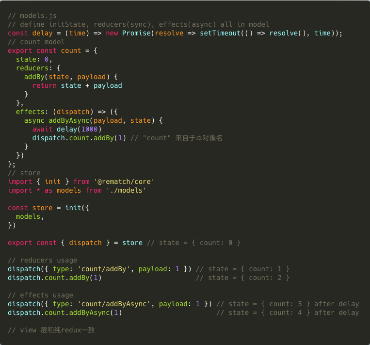
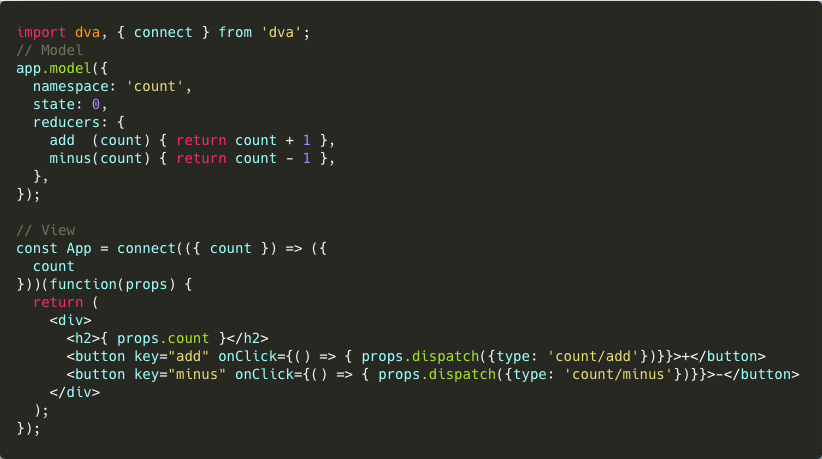
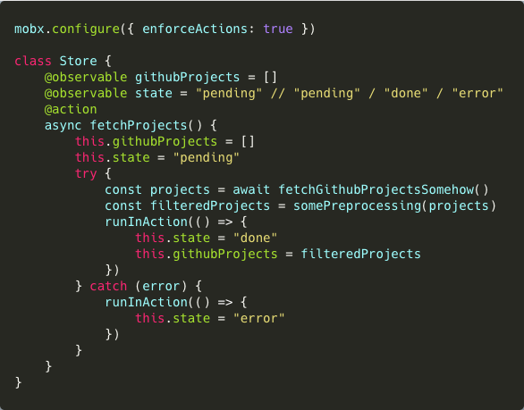
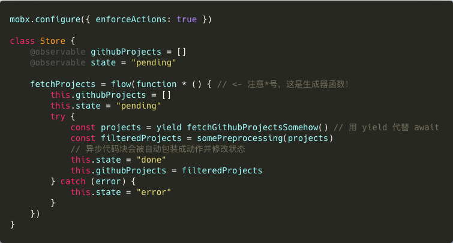
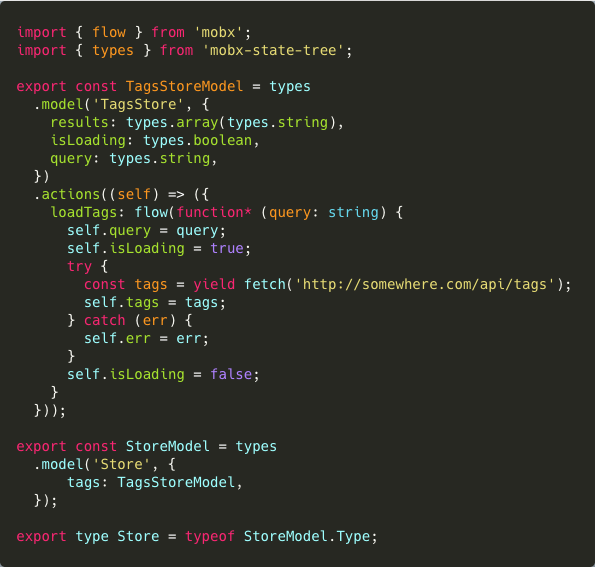
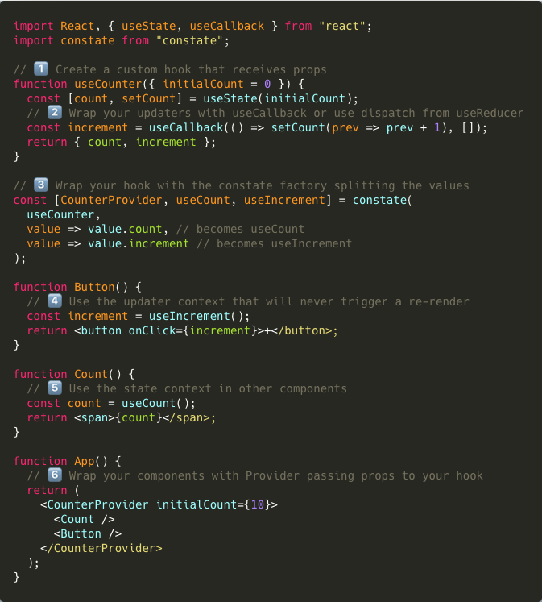
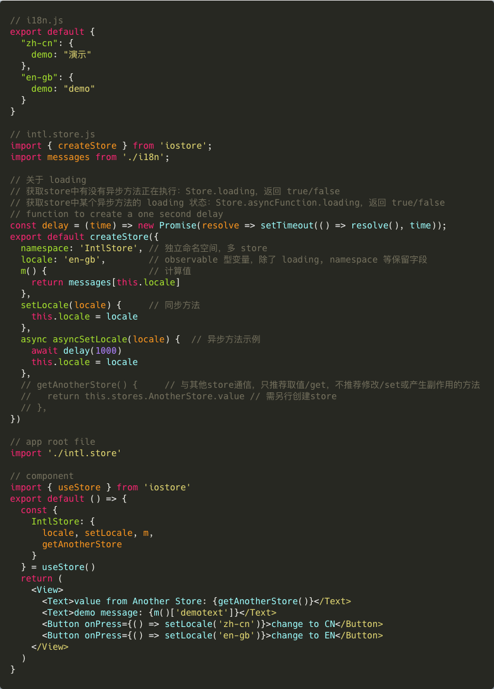

# 前端深水区（Deepsea）React 状态管理库研究

TODO:
- [ ] hox
- [ ] undux
- [ ] easy-peasy
- [ ] rxjs, cycle.js
- [ ] 状态机

## 前言

状态管理作为前端的核心问题，能够和团队的技术风格和开发的思维模式互相影响，并决定应用的上下限。
像评价或比较前端框架一样，对于各种状态管理库，没有简单的好坏之分，它们只是在不同的维度上做了取舍。

但作为业务工程师，我们期望的还是有一种瑞士军刀库，能够胜任绝大多数需求。

本文的目标是分析代表性的 React 开源状态管理库，供一线开发者和技术管理选型参考。

> my js state management library: `{}`
>
> [*TJ Holowaychuk*](https://twitter.com/tjholowaychuk/status/957853652483416064?lang=en)

## 评价标准

- **易学**：一般开发者对于该库理论模型的理解成本和学习曲线，亦可能是选择库的**最佳标准**。原始理论模型（如 flux，有限状态机，响应式编程等）越清晰越好；接口设计越好，语义表现力越强，用较少的代码即可实现功能。一个易学的库通常总会更受欢迎。
- **功能**：复杂的应用可能会有特殊功能需求，如时间回溯（撤销与重现），和其他库（路由等）联动；对此有现成解决方案的库会更受欢迎。
- **扩展**：可扩展性 -- 随着应用复杂度上升、代码堆积和不同风格的程序员加入，库应该提供高效的结构保持性能稳定，和优良的模式来定位错误并便于测试。
- **生态**：好的库离不开社区支持和文档支持。使用库的过程中总会遇到各种问题，但流行的库有大量前人踩坑经验，并由可靠的开发者更新**源码**，维护**文档**和开发**中间件**、各种**插件**（如浏览器，编辑器语法高亮或智能提示，命令行工具甚至第三方平台服务），也有较好的社区交流（github, stackoverflow, 语雀，slack, spectrum等）可供参考。当然最重要的是，你能找到足够多有相关经验的开发者。强大的社区支持也是稳定性的重要保障。
- **性能**：性能也是重要考量之一，也是众多库竞争的重点。库在应用不同复杂度下的执行效率，需要多少手动优化，弱网络环境下应用的加载速度，包和必需组件包的大小（如redux+react-redux）。

## Redux (Flux) 系

> Redux is a predictable state container for JavaScript apps.

Redux 基于 flux 和函数式编程，是 React 官方推荐且最受欢迎的库。redux 本身可以跨平台应用，目前通过社区插件 [@angular-redux/store](https://github.com/angular-redux/store)，[vuejs-redux](https://www.npmjs.com/package/vuejs-redux) 实现。

redux 的实现可以直接看源码，或者这个很棒的[从零实现](https://github.com/brickspert/blog/issues/22)。

[flux](https://facebook.github.io/flux/docs/in-depth-overview/) 的经典流程模型：

1. redux **不关心框架实现**，把全部状态作为子节点挂载于一个`store`树下(**单一数据源**)，提前注册全部的 `actions` 和 `reducers`。
2. react-redux 利用React 官方的 `Context API`[3]，由 `Provider` 将 store 注入APP顶层。
3. 各组件使用高阶函数 API `connect()` 拿到 `context(=store)` 并筛选所需的状态子节点传入 `props`。
4. 由于库的强约束，各组件能并只能发送（`dispatch`）action 通过 reducer 修改 store。
5. 因为store是不可变对象（**状态只读**），此修改必须为替换式修改（子节点对象可为浅拷贝），新store通过对应的reducer（**由纯函数改变**）生成新store对象，触发React更新通知全部组件，然后各组件按照各自对子节点的订阅决定是否更新。

[react hooks](https://reactjs.org/docs/hooks-intro.html) 使函数组件能能访问本地组件状态 `useState()`，执行副作用`useEffect()`等。

### Redux 特性
- 单一数据源 (single source of truth)
- 不可变数据 (state is read-only)
- 纯函数操作 (changes are made with pure functions)

库的代码写得优雅简约，没有内藏黑魔法也没干”脏活“，在几乎无约束，极高自由度的同时，完全无法做到开箱即用，把非常多的问题（缓存，异步，订阅，记录/重放等）留给开发者或者中间件解决。如使用[immer](https://github.com/immerjs/immer), [immutable.js](https://github.com/immutable-js/immutable-js), [reselect](https://github.com/reduxjs/reselect)控制性能, 使用 redux-saga, redux-observable来处理异步。如此大大增加了开发成本。

flux 靠主动”拉“数据 (pull-based) 来获取更新，有极佳的确定性（全靠手写显式声明），代价是所有的更新都需要手动获取，在状态复杂多样时十分繁琐。

单一数据源要求全局单一的store，优点是所有状态都可以零成本互相访问，子组件父组件访问的是同一数据源无需同步，缺点是命名冲突（需要好的设计）和性能问题，原因包括遍历全部action type，和无关变量变更引起不必要的更新。

单向数据流相比双向，能对数据变化有更好的记录、追踪，通过显式调用更直观，没有”黑魔法“，但也以增加代码量，在处理大量局部状态（用户交互等）时全部需要**极为繁琐地显式声明**为代价。事实上单向数据流已经被绝大多数库使用，并在处理用户交互组件的状态时能通过多写代码”变“成双向数据流。这种情况下，单双向数据流的区别也只是显式/隐式声明数据变化的操作而已[2]。由此，本文不作更多讨论。

不可变数据要求对store的改变必须通过统一位置预定义的**纯函数**生成新store，实现了稳定可预测，可时间回溯，易测试，隔离“副作用”（用户交互和网络交互）；但同时导致业务工程师需要做”额外“的工作，既要 1) 为保证更新返回全新JS对象(参考immer)， 2）为防止更新缓存”相同”的对象（参考reselect），3) 实现纯函数必须分离副作用(redux-thunk, redux-saga)；另外，替换式更新也会消耗更多内存并损失性能。

另外，细致的分层（action, reducer, store）和重复声明大量基础定义(action type, switch)导致样板代码十分啰嗦，即使实现简单的功能也需写大量代码。

进入 hooks 时代后，react-redux通过新的API [useSelector](https://react-redux.js.org/api/hooks#using-hooks-in-a-react-redux-app) 一方面省去了高阶组件(HOC)，一方面改变了触发渲染的比较模式。

然而由于 hooks 模式下组件不再使用 `connect()`（内置 memorization），需要开发者自行缓存组件 `React.memo()`，容易面临性能问题

绝大多数的功能已被社区插件补足，样板代码过多也由以下redux的高级封装库提供了解决方案：

### [Rematch](https://github.com/rematch/rematch)
> Rematch 是 Redux 不用写样板代码的最佳实践。 
> [Rematch 官网](https://rematch.gitbook.io/handbook/)

Rematch 作者在 [重新设计 Redux](https://hackernoon.com/redesigning-redux-b2baee8b8a38) 中提出了一个公式：
> 工具库质量 = 其节省的时间/其消耗的时间

Count 实现: 核心代码 <a href="https://codesandbox.io/s/3kpyz2nnz6" target="_blank">完整代码</a>

Rematch 像给 redux 包装了语法糖并处理了副作用，让业务代码简练易懂：
- 把 redux 函数式的初始配置（store、action、reducer）转换成了面向对象的方式，大大简化了创建过程
- action 被直接挂在 `dispatch` 对应 model/namespace 下，不再用字符串显式声明 action type；进而把副作用 action 独立为 `effects`，而同步 action 成为 `reducers`（不再是 redux 中的 reducer，因为 action type 无需入参，payload 取代 { type, payload }），减少代码量并降低理解成本
- 支持原生 `async/await`，用友好的方式处理了异步
- 注册全局 `dispatch`，方便各组件调用 action
- 集成常用插件（如[rematch-immer](https://github.com/rematch/rematch/blob/master/plugins/immer/README.md)）形成生态

rematch 已经由 typescript 写成，[等 react-redux 解决了性能问题](https://github.com/rematch/rematch/issues/610)，rematch 将支持 hooks。

### [Dva](https://github.com/dvajs/dva)
> dva 首先是一个基于 redux 和 redux-saga 的数据流方案，然后为了简化开发体验，dva 还额外内置了 react-router 和 fetch，所以也可以理解为一个轻量级的应用框架。

把 dva 放在第二位，是因为其本质上已经不是一个状态管理库，而是一个综合性应用框架（封装了 react-dom, react-router 等）。在状态管理方面如简介所言，集成了 redux-saga 来处理异步，同时语法上和 rematch 类似，极大减少了使用 redux 需要写的脚手架代码，已经有很多成熟大规模应用和插件，十分可靠。当然，**集成度越高，约束性越强，自由度越低。**

dva 🌰核心代码 <a href="https://stackblitz.com/edit/dva-example-count">完整代码</a></dva>

其他还有mirror,react-coat 等相对小众的方案。

---

## 响应式库
现代JS 响应式库一般基于 [Proxy](https://developer.mozilla.org/zh-CN/docs/Web/JavaScript/Reference/Global_Objects/Proxy)，代表有 mobx，vuex（受mobx启发的vue官方状态管理）。 
更加函数式、流式、侵入性强的解决方案有 [rxjs](https://rxjs-dev.firebaseapp.com/guide/overview) 等。

### [Mobx](https://github.com/mobxjs/mobx)

> 通过透明的函数响应式编程 (transparently applying functional reactive programming - TFRP) 使得状态管理变得简单和可扩展。 
> 一切源自状态的东西都应该自动被获得。

mobx 受欢迎程度仅次于 redux ([You Might Not Need Redux](https://medium.com/@dan_abramov/you-might-not-need-redux-be46360cf367))，其特性：

- 响应式改变（可观测的状态 observable，计算值 computed，反应 reaction)
- 可变数据 mutable
- 多 store

mobx 为代表的响应式库，能够自动收集依赖并响应式改变相关状态，能极大节约开发者的代码量和时间，易学易用，且能防止低水平开发者写出有性能问题的代码（多做多错）；另外，多 store 也避免了无关状态触发更新导致的性能问题；因此无需优化也能得到较好的性能。

当然，响应式库靠”推“ (push-based) 来告知数据更新，代价是数据可变，无法做到纯函数，获取数据的方式较”魔法“而不显而易见。

另外 mobx 较 redux 臃肿不少 (15.2kB : 2.6kB)。由于多 store 的关系，考虑各种状态的安置，store 间的交互也是额外的成本。

关于 mobx 的性能，可以参考这篇 [文章](https://hackernoon.com/an-artificial-example-where-mobx-really-shines-and-redux-is-not-really-suited-for-it-1a58313c0c70) 以及 [redux、immutablejs 和 mobx 性能对比](https://www.cnblogs.com/kwzm/p/9884955.html)。

结论：
> 由于 Mobx 利用 getter 和 setter（未来可能会出现一个平行的基于 Proxy 的版本【注：Mobx@5 以后应用】）去收集组件实例的数据依赖关系，因此每单当一个点发生更新的时候，Mobx 知道哪些组件需要被更新，决定哪个组件更新的过程的时间复杂度是 O (1) 的，而 Redux 通过脏检查每一个 connect 的组件去得到哪些组件需要更新，有 n 个组件 connect 这个过程的时间复杂度就是 O (n)，最终反映到 Perf 工具上就是 JavaScript 的执行耗时。
>
> **虽然在经过一系列优化后，Redux 的版本可以获得不输 Mobx 版本的性能，但是 Mobx 不用任何优化就可以得到不错的性能。而 Redux 最完美的优化是为每一个点建立单独的 store，这与 Mobx 等一众精确定位数据依赖的方案在思想上是相同的。** 
> [有赞前端](https://juejin.im/post/5a1e25ad5188253d681756a5)

示例项目 [react-mobx-realworld-example-app](https://github.com/gothinkster/react-mobx-realworld-example-app)

mobx 需要[特殊处理异步](https://cn.mobx.js.org/best/actions.html)，其中值得推荐的是 `async/await + runInAction()` 的组合（原生自然）和 `flows + generator` 的组合（类似 redux-saga）

async/await + runInAction() 举例

flows + generator 举例

另一个问题是，如果不能用装饰器（decorator），[mobx 的简洁性大打折扣](https://mobx.js.org/best/decorators.html)。而 redux 只能用 `@connect`，区别不大。React 官方出品的脚手架 [CRA](https://github.com/facebook/create-react-app)(create-react-app) 并不支持 decorator，除非 [eject](https://github.com/facebook/create-react-app/blob/master/packages/react-scripts/template/README.md#npm-run-eject) 或者转向 [Next.js](https://nextjs.org/) 等框架。

mobx 采用可变数据（mutable），不原生提供事务化（transactional）的状态管理，因此较难进行时间旅行、状态回溯，测试等，优点是性能无需优化，样板代码少，更自动化，相比之下，Redux更“[Elm](https://elm-lang.org/)“（函数式编程语言）。因此可以看到一般都会推荐在中小型应用中使用mobx以降低开发成本，在大型应用中用redux以降低维护成本。当然，小型、中型、大型应用的临界点在哪，就是另一个问题了。

社区中关于 redux 和 mobx 的比较汗牛充栋，选取一篇近期不错的 [对比文章](https://www.bacancytechnology.com/blog/redux-vs-mobx) 作参考。

### [mobx-state-tree](https://github.com/mobxjs/mobx-state-tree)
mobx 的作者又推出了将redux和mobx的优点结合的 [mobx-state-tree](https://github.com/mobxjs/mobx-state-tree)，具有如下特点：

- 各子节点类型预定义，有运行时类型安全检查，但增加了代码量
- 单一（single）可变（mutable）状态树（tree）
- 原生支持时间旅行，追踪（`snapshot`）等功能
- [存在性能优化空间](https://github.com/mobxjs/mobx-state-tree/issues/440)，[创建 model 时程序开销极大且为同步函数](https://itnext.io/fairytale-about-performance-in-web-application-ed2bf12627fc)，暂时不建议在生产环境使用。

参考代码

---

## 基于 React 特性的库 (无法跨框架)

其实通过之前 redux 系和 mobx 可以看出，React 环境下的状态管理最终实现还是基于 `Context API`，因此自 `React@16.3` 发布新 `Context()` 能够直接透（过多层组件）传 context 后，`unstated`、`react-waterfall` 等应运而生。

### [unstated](https://github.com/jamiebuilds/unstated)
由广受欢迎的 [react-loadable](https://github.com/jamiebuilds/react-loadable) [作者](https://github.com/jamiebuilds)所写，其 Container 作为高阶组件只用 `setState()` 存储状态，同时用 render props 注入状态，写起来比 redux "更像" React 的原生解决方案。更多请阅读[这篇文章](https://zhuanlan.zhihu.com/p/48219978)。

### [unstated-next](https://github.com/jamiebuilds/unstated-next)，[constate](https://github.com/diegohaz/constate)
随着 `React@16.8` [react hooks](https://reactjs.org/docs/hooks-intro.html) 的发布，
相比旧 `context` 少了一层 consumer 嵌套，并赋予函数式组件存取状态的能力，但提升了理解成本和对代码组织设计的需求。

hooks 又催生了大批新鲜出炉的状态管理库，有结合 rxjs 的 [rxjs-hooks](https://github.com/LeetCode-OpenSource/rxjs-hooks) 和 [useObservable](https://github.com/streamich/react-use/blob/master/docs/useObservable.md) 等；unstated 的作者也推出了 [unstated-next](https://github.com/jamiebuilds/unstated-next)，用 "React" 的方式再一次做出示范；笔者也参照其思路实现了 API 更简化的 [noctx](https://github.com/w10036w/noctx)。另外，[constate](https://github.com/diegohaz/constate) 的作者提供了另一种思路，源码同样简洁高效。

constate 示例

### [easy-peasy](https://github.com/ctrlplusb/easy-peasy)

### hox

### [iostore](https://github.com/yisbug/iostore)

iostore 从定义一个 store 看像 rematch 的 hooks 版，虽然实际上更类似于 mobx 响应式 + 多 store：
- 类 mobx 响应式：基于 `Proxy` 代理对象属性，多 store；
- 类 rematch 面向对象：类似于 rematch，初始化命名空间, 各属性名，计算属性，同步、异步方法；
- 使用 `useEffect(fn, [])`，为每个 store 注册订阅函数；
- 简洁高效：API 只有两个: `createStore()` `useStore()`，无需 Provider，Consumer 层；
- 引入 loading 可以监控异步方法/ store 的状态

笔者写了一个切换语言的例子

缺点：功能单一，未经众多项目实战检验，部分实现有待改进，如[计算属性](https://github.com/yisbug/iostore/issues/6)

如果没有复杂需求，比如时间回溯等功能，可以大胆尝试。

## 流式数据 [rxjs](https://rxjs-dev.firebaseapp.com/guide/overview)

响应式编程（reactive programming）已有各种实现，全面采用响应式的有 [cycle.js](https://cycle.js.org/) 框架，和 React 不兼容故在此不作深入。

作为学习成本最高的状态管理代表，

### rxjs + hooks

### ~~响应式~~事件驱动 [Effector](https://github.com/zerobias/effector)

[Effector 核心理念](https://effector.now.sh/en/introduction/core-concepts)
- 多 `store`
- `event` （事件）驱动更改 store，同时通过 `watch` 监听副作用来触发新事件
- `effect` 作为异步函数的容器，由 `createEffect` 创建，通过其方法 `{ done, fail }` 成为 event 驱动更改
- 跨框架，目前已有 react, vue, svelte 的样例实现。

Effector 另辟蹊径，使用监听类 Node.js **事件**的方式代替 action 更改 store。同时， event 和 stores 是响应式的流式数据(stream)，可用自有方法 `watch` 订阅，作为 Observerable 也可以进行多种操作如 `map, combine, merge, split` 等。

## 有限状态机
有限状态机（finite-state machine，FSM）方案核心思路
- 符合状态是有限的
- 某一时刻，只有一种状态
- 到达某个时刻，会转变另一种状态。

此类库最大的优势是显示声明所有状态和变化条件，代码虽然繁琐但更具有整体性、一致性

以 [xstate](https://github.com/davidkpiano/xstate)， [robot](https://github.com/matthewp/robot) 为代表，由于需要在一开始显式声明所有状态和变化方式，代码较繁琐，

## 推荐
在项目复杂度达到必须引入状态管理库后：

如果想尽快交付，并兼顾性能，稳定性，扩展性，选择 `mobx`，`rematch`

如果改造旧 redux 项目，尝试 `dva`、`rematch`；

如果希望写 ”React" 式的状态管理，那么 `unstated`、`unstated-next` 十分适合；

如果想全面拥抱 hooks，那么可以选择 `unstate-next`, `constate`；`iostore` 和 笔者的 `noctx` 也值得一试；

如果为全新的项目自由选择库，在团队没有明显倾向时可以优先考虑 `mobx、rematch、unstated` 等久经考验、熟练者多，难度较低的库。

如果喜欢一站式的解决方案，要么 `dva` 一把梭，要么 `mobx` 全家桶 或成熟的 `redux` 全家桶。

重交互场景，数据流控制异常复杂的可以选择 rxjs 系

如果赞同状态机的理念，可以选择 `xstate`

希望探索 状态管理库 本身，想要造轮子的可以研究各库的源码，以及 [vuex](https://vuex.vuejs.org/guide/)。

## 评分

| 名称 | 大小* |
| :-- | ---:  |
| [redux](https://redux.js.org/introduction/getting-started) + redux-react | 2.6kB + 5.5kB |
| [rematch](https://github.com/rematch/rematch) + redux-react | 5.1kB + 5.5kB |
| [dva](https://github.com/rematch/rematch) | 36kB |
| mobx + mobx-react | 15.2kB + 4.6kB |
| [mobx-state-tree](https://github.com/mobxjs/mobx-state-tree) | 19.7kB |
| [unstated](https://github.com/jamiebuilds/unstated) | 1.8kB |
| [iostore](https://www.npmjs.com/package/iostore) | 1kB |
| [xstate](https://github.com/davidkpiano/xstate) + @xstate/react | 16.2kB |
| [rxjs](https://rxjs-dev.firebaseapp.com/guide/overview) | 10.8kB* |
| [effector](https://github.com/zerobias/effector) + effector-react | 6.3kB + 1.7kB |

*minified+gzipped, source: [https://bundlephobia.com/](https://bundlephobia.com/)
*rxjs 支持

## One More Thing

对于和后端有复杂交互的应用，需要考虑
1. 应用内部的状态
2. 用户交互部分的状态
3. 和后端的状态（增删改查，订阅）同步。

在 [Restful](https://www.ruanyifeng.com/blog/2011/09/restful.html) 时代，前端状态和后端状态是割裂的，对于3) 的处理也是五花八门。

随着 [GraphQL](https://graphql.cn/learn/) 的兴起，受到新序列化格式的启发，GraphQL 阵营中
[Apollo](https://blog.apollographql.com/) 对客户端状态使用 `@client` 的 directive 标记，希望用统一的GraphQL语法（或data graph）实现上述三种不同状态的序列化存储；而 [Relay](https://relay.dev/docs/en/local-state-management) 则选择沿着 flux 的道路继续前进。

此种类型类似 cycle.js 一般和框架深度结合，拥有最强的约定，学习成本高，如果团队已经深入相关生态建议采用。

## 结论

React 的设计理念是函数式编程，所以推崇纯函数，函数式组件和数据不可变。

纵观各种状态管理库，提炼出决定开发体验的几点理想特性以供参考

- **低理解成本或多用已有概念，对新手友好** (如 unstated)
- **减少组件层级，便于维护** (如使用 hooks)
- **自动化收集依赖和变化，或自动生成相关代码** (mobx)
- **性能无需手动优化，可扩展可维护**
- **文档齐全，实战检验，社区活跃，面向未来** (redux)
- **业务代码简洁有力，开箱即用和渐进式开发并举**

笔者得到的最大启发还是

**顺畅的开发体验就是一切。**[**A smooth development experience is everything.**](https://medium.com/skillshare-team/how-we-ditched-redux-for-mobx-a05442279a2b)

**为需求服务，不要解决不存在的需求。**

**生命苦短，多学更重要的设计理念，少加班写代码。**

参考资料

- Kent C. Doods [Application State Management with React](https://kentcdodds.com/blog/application-state-management-with-react)
- Michel Weststrate [Becoming fully reactive: an in-depth explanation of MobX](https://medium.com/hackernoon/becoming-fully-reactive-an-in-depth-explanation-of-mobservable-55995262a254)
- Shawn McKay [Redesigning Redux](https://hackernoon.com/redesigning-redux-b2baee8b8a38)
- [2]kuitos的回答 - 知乎[单向数据绑定和双向数据绑定的优缺点，适合什么场景？](https://www.zhihu.com/question/49964363/answer/136022879)
- [3]知乎 敖玄 [react-redux设计结构变迁](https://zhuanlan.zhihu.com/p/86336676)
- [4]知乎 字节跳动技术团队[React新Context API在前端状态管理的实践](https://zhuanlan.zhihu.com/p/47390835)
- [5]知乎 程墨Morgan [unstated: 可能是简单状态管理工具中最好的](https://zhuanlan.zhihu.com/p/48219978)
- [支付宝前端应用架构的发展和选择](https://github.com/sorrycc/blog/issues/6)
- [MVVM 框架的数据状态管理的发展与探索](https://github.com/farzer/blog/issues/1)
- [Why do I choose Effector instead of Redux or MobX?](https://dev.to/lessmess/why-i-choose-effector-instead-of-redux-or-mobx-3dl7)
- [How Redux Connect compares to the new Redux Hooks](https://itnext.io/how-existing-redux-patterns-compare-to-the-new-redux-hooks-b56134c650d2)
- [The 12 Things You Need to Consider When Evaluating Any New JavaScript Library](https://www.freecodecamp.org/news/the-12-things-you-need-to-consider-when-evaluating-any-new-javascript-library-3908c4ed3f49/)]