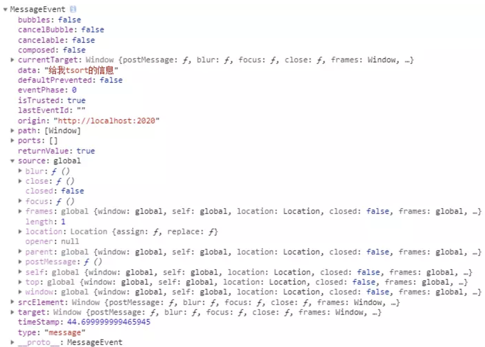

# interview - browser 浏览器

## 基础知识
- `进程` process 是 CPU 资源分配的最小单位；
- `线程` thread 是 CPU 调度的最小单位，一个进程可有多个线程；
- 不同 `进程` 间可通信，但代价大；
- `单线程` 与 `多线程` ，指在一个 `进程` 内的情况

### 浏览器进程

- 主进程
  - 控制其他进程（创建销毁协调）
  - 界面 UI 显示，用户交互，前进后退收藏
  - 将渲染进程得到的内存中的 Bitmap，绘制到用户界面上 ？？？
  - 处理网络请求，文件访问等
- 第三方插件进程：每插件一个进程
- GPU进程：3D绘图
- 渲染进程（浏览器内核）
  - 页面渲染，脚本执行，事件处理
  - **每 tab 创建一个独立进程**

对于 `渲染进程`，其多线程如下：
- GUI 渲染线程
  - 负责渲染页面，布局和绘制
  - 页面需要重绘和回流时，该线程就会执行
  - 与 js 引擎线程互斥，防止渲染结果不可预期
- JS引擎线程
  - 负责处理解析和执行 javascript 脚本程序
  - 只有一个 JS 引擎线程（单线程）
  - 与 GUI 渲染线程互斥，防止渲染结果不可预期
- 事件触发线程
  - 用来控制事件循环（鼠标点击、setTimeout、ajax 等）
  - 当事件满足触发条件时，将事件放入到 JS 引擎所在的执行队列中
- 定时触发器线程
  - setInterval 与 setTimeout 所在的线程
  - 定时任务并不是由 JS 引擎计时的，是由定时触发线程来计时的
  - 计时完毕后，通知事件触发线程
- 异步 http 请求线程
  - 浏览器有一个单独的线程用于处理 AJAX 请求
  - 当请求完成时，若有回调函数，通知事件触发线程

尽量不使用 document.write()，知道 [passive 的事件监听器](https://zjy.name/passive-event-listeners/)是什么

## 浏览器渲染

DOM -> CSSOM -> Render Tree -> Layout -> Paint -> Composite
- 构建 DOM 树: 1) 页面初次加载, 获取 `html`, 构建 `DOM` 树; 2) js 修改了节点, 再次构建;
- 构建渲染树: 根据 `css` 生成 `CSSOM`, 和 `DOM` 合并构建为 `render` 树，render 树中不包含 定位和几何信息
- 构建布局树: `layout`，含有元素的定位和几何信息, 可能随 JS 指令重新计算, 称为 回流 (reflow)
- 绘制 (paint): 遍历渲染树，调用渲染器的 paint() 方法在屏幕上绘制出节点内容，本质上是一个像素填充的过程。这个过程也出现于回流或一些不影响布局的 CSS 修改引起的屏幕局部重画，这时候它被称为重绘（Repaint）。实际上，绘制过程是在多个层上完成的，这些层我们称为渲染层（RenderLayer）
- 渲染层合成 (Composite) :多个绘制后的渲染层按照恰当的重叠顺序进行合并，而后生成位图，最终通过显卡展示到屏幕上

`渲染层 (RenderLayer)`: 浏览器创建新渲染层的情况:
  - DOM 根元素 `document`
  - CSS `position（relative、fixed、sticky、absolute）`, `opacity < 1`, `filter`, `mask`, `mix-blend-mode` 不为 `normal`, `transform` 非 `none`, `backface-visibility: hidden`, `reflection`, `column-count` 值不为 auto, `column-width` 属性且值不为 auto, `overflow` 不为 `visible`
  - 当前有对于 `opacity`, `transform`, `fliter`, `backdrop-filter` 应用动画

`重绘(repaint, redraw)`: **绘制阶段**, 改变每个元素外观时所触发的浏览器行为，比如颜色，背景等样式发生了改变而进行的重新构造新外观的过程。重构不会引发页面的重新布局，不一定伴随着回流

`回流, 重排(reflow)`: **构建布局阶段**, 浏览器为了重新渲染页面的需要而进行的重新计算元素的几何大小和位置的，他的开销是非常大的，回流可以理解为渲染树需要重新进行计算，一般最好触发元素的重构，避免元素的回流；比如通过通过添加类来添加 css 样式，而不是直接在 DOM 上设置，当需要操作某一块元素时候，最好使其脱离文档流，这样就不会引起回流了，比如设置 position：absolute 或者 fixed，或者 display：none，等操作结束后在显示。

触发重排的条件：任何页面布局和几何属性的改变都会触发重排：
- 页面渲染初始化 (无法避免)
- 添加或删除可见的 DOM 元素
- 元素位置的改变，或者使用动画
- 元素尺寸的改变 —— 大小，外边距，边框
- 浏览器窗口尺寸的变化
- 填充内容的改变，比如文本的改变或图片大小改变而引起的计算值宽度和高度的改变

重排必定会引发重绘，但重绘不一定会引发重排。

作者：谢小飞
链接：https://juejin.im/post/5df1e312f265da33d039d06d
来源：掘金
著作权归作者所有。商业转载请联系作者获得授权，非商业转载请注明出处。

## 浏览器缓存
> https://www.geekjc.com/post/5d37f67480c18e4071ccc440

浏览器缓存分为强缓存和协商缓存。当客户端请求某个资源时，获取缓存的流程如下 (命中协商缓存 `304`, 命中强缓存 `200`)

1. 先根据这个资源的一些 `http` `header` 判断它是否命中强缓存，如果命中，则直接从本地获取缓存资源，不会发请求到服务器；
2. 当强缓存没有命中时，客户端会发送请求到服务器，服务器通过另一些 `request header` 验证这个资源是否命中协商缓存，称为 `http 再验证`，如果命中，服务器将请求返回，但不返回资源，而是告诉客户端直接从缓存中获取，客户端收到返回后就会从缓存中获取资源；
3. 强缓存和协商缓存共同之处在于，如果命中缓存，服务器都不会返回资源； 区别是，**强缓存对发送请求到服务器，但协商缓存会**。
4. 当协商缓存也没命中时，服务器就会将资源发送回客户端。
5. 当 `ctrl+f5` 强制刷新网页时，直接从服务器加载，跳过强缓存和协商缓存；
6. 当 `f5` 刷新网页时，跳过强缓存，但是会检查协商缓存；

### 强缓存
通过默认 http 请求发送, 命中时 `200`, 优先级从高到低

- `Cache-Control:max-age`: 定义于 `http1.1`，利用其 `max-age` 值来判断缓存资源的最大生命周期，它的值单位为 `秒`
  ```js
  Cache-control: max-age=30 // 30s 后过期
  // 'no-store': 不需要缓存的资源
  // 'no-cache' + Etag: 频繁变动
  // 'max-age=31536000' + Etag: 代码文件, 一旦文件名变动即重新下载
  ```
- `Expires`: 定义于 `http1.0`，值为 `GMT字符串`，代表缓存资源的过期时间
  ```js
  Expires: Wed, 22 Oct 2018 08:41:00 GMT // 此时间后过期; 受本地时间影响
  ```

### 协商缓存
通过新的 http 请求发送, 命中时 `304`, 优先级从高到低

- `ETag` + `If-None-Match`: `Etag` 表资源唯一标识，客户端如发现 (资源) 有 `Etag` (之前自服务器发来), 通过 `If-None-Match` 将其发送给服务端, 如服务端发现 `Etag` 不一致则发更新的资源，否则命中
- `Last-Modified` + `If-Modified-Since`: `Last-Modified` 为本地文件最后修改日期 (之前服务端发来). 客户端如发现有 `Last-Modified`, 通过 `If-Modified-Since` 将其发送至服务端, 如服务端发现此日期后有更新则发资源, 否则命中. 但是如果在 `本地打开缓存文件`， `Last-Modified` 会被修改

## CORS 跨域
同源策略：浏览器安全策略，同协议、ip、端口的脚本才会执行。
只要协议、域名、端口有任何一个不同，都被当作是不同的域
1. `NGINX 反向代理`: `proxy_pass http://xxx.xxx.xxx`
2. 服务端 如 `express`, `koa` 配置 `cors`
3. 通过 `jsonp` 跨域
jsonp在页面上引入不同域上的 js 脚本文件实现请求不同域上的数据
  - 通过 `script` 标签引入一个 js 文件
  - js 文件载入成功后会执行我们在url参数中指定的函数，并且会把我们需要的json数据作为参数传入
    注：需要服务器端的页面进行相应的配合
4. 通过修改document.domain来跨子域
5. 使用 `window.name` 来进行跨域
window对象有个name属性，该属性有个特征：即在一个窗口(window)的生命周期内,窗口载入的所有的页面都是共享一个window.name的，每个页面对window.name都有读写的权限，window.name是持久存在一个窗口载入过的所有页面中的，并不会因新页面的载入而进行重置。

## 安全
### CSRF 攻击
前端构造一个恶意页面，请求 JSONP 接口，收集服务端的敏感信息。如果 JSONP 接口还涉及一些敏感操作或信息（比如登录、删除等操作），那就更不安全了。

**解决方法**：验证 JSONP 的调用来源（Referer），服务端判断 Referer 是否是白名单，或者部署随机 Token 来防御。

### XSS 漏洞
不严谨的 `content-type` 导致的 XSS 漏洞，想象一下 JSONP 就是你请求 `http://youdomain.com?callback=douniwan`, 然后返回 `douniwan({ data })`，那假如请求 `http://youdomain.com?callback=<script>alert(1)</script>` 不就返回 `<script>alert(1)</script>({ data }`) 了吗，如果没有严格定义好 `Content-Type（ Content-Type: application/json`，再加上**没有过滤 callback 参数**，直接当 html 解析了，就是一个赤裸裸的 XSS 了。

**解决方法**：严格定义 `Content-Type: application/json`，然后严格过滤 `callback` 后的参数并且限制长度（进行字符转义，例如 <换成 & lt，> 换成 & gt）等，这样返回的脚本内容会变成文本格式，脚本将不会执行。

### 服务器被黑，返回一串恶意执行的代码
可以将执行的代码转发到服务端进行校验 JSONP 内容校验，再返回校验结果。

### XSS 和 CSRF 区别
XSS 跨站脚本攻击（Cross Site Scripting)，为了不和层叠样式表 CSS 混淆，故将跨站脚本攻击缩写为 XSS。恶意攻击者往 Web 页面里插入恶意 Script 代码，当用户浏览该页之时，嵌入其中 Web 里面的 Script 代码会被执行，从而达到恶意攻击用户的目的。

CSRF 跨站请求伪造（Cross-site request forgery），是伪造请求，冒充用户在站内的正常操作。我们知道，绝大多数网站是通过 cookie 等方式辨识用户身份，再予以授权的。所以要伪造用户的正常操作，最好的方法是通过 XSS 或链接欺骗等途径，让用户在本机（即拥有身份 cookie 的浏览器端）发起用户所不知道的请求。

区别：
- 原理不同，CSRF 是利用网站 A 本身的漏洞，去请求网站 A 的 api
- XSS 是向目标网站注入 JS 代码，然后执行 JS 里的代码。
- CSRF 需要用户先登录目标网站获取 cookie，而 XSS 不需要登录
- CSRF 的目标是用户，XSS 的目标是服务器
- XSS 是利用合法用户获取其信息，而 CSRF 是伪造成合法用户发起请求

## 跨页面通讯
- [`BroadcastChannel()`](https://developer.mozilla.org/en-US/docs/Web/API/Broadcast_Channel_API): `.postMessage()`, `.onmessage()`, `.close()`
- `ServiceWorker`
- `WebSocket` (可无痕模式用)
- `locatStorage` + `window.onstorage`
- `IndexedDB / cookies / Worker` + `setInterval()`
- window.open + [window.postMessage](https://developer.mozilla.org/en-US/docs/Web/API/Window/postMessage)

### 跨页面通信代码实现
`WebWorker`
```js
// main.js
if(window.Worker) {
  var myWorker = new Worker('http://xxx.com/worker.js');
  // 发送消息
  first.onchange = function() {
      myWorker.postMessage([first.value, second.value]);
      console.log("Message posted to worker");
  }
  second.onchange = function() {
    myWorker.postMessage([first.value,second.value]);
    console.log('Message posted to worker');
  }
  // 主线程 监听onmessage以响应worker回传的消息
  myWorker.onmessage = function (e) {
    var textContent = e.data;
    console.log("message received from worker");  
  }
}
// worker.js
// 内置 self 对象, 代表子线程本身
self.onmessage = function(e) {
  console.log("message received from main script");
  var workerResult = "Result: " + (e.data[0] * e.data[1]);
  console.log("posting message\back to main script");
  postMessage(workerResult);
}
// worker内部要加载其他脚本,可通过 importScripts() 方法
self.importScripts('foo.js');
```
`ServiceWorker`
```js
if('serviceWorker' in window.navigator) {
  // 对于多个不同scope的多个Service Worker,我们也可以给指定的Service Worker发送消息
  navigator.serviceWorker.register('./sw1.js', { scope:'./sw1'})
    .then(function(reg) {
      console.log('success', reg);
      return new Promise((resolve, reject) => {
        const interval = setInterval(function() {
          if(reg.active) {
            clearInterval(interval);
            resolve(reg.active);
          }
        }, 1000);
      }).then(sw => sw.postMessage("page -> sw1");)
    })
  navigator.serviceWorker.register('./sw2.js', { scope:'./sw2'})
    .then(function(reg) {
      console.log('success', reg);
      return new Promise((resolve, reject) => {
        const interval = setInterval(function() {
          if(reg.active) {
            clearInterval(interval);
            resolve(reg.active);
          }
        }, 1000);
      }).then(sw => sw.postMessage("page -> sw2"))
    });
    navigator.serviceWorker.addEventListener('message', function (event) {
      console.log(event.data);
      // 接受数据，并填充在 DOM 中
      document.getElementById('showArea').value = event.data ;
    });
}

// sw1.js
self.addEventListener("message", function(event) {
  console.log("sw1.js " + event.data);
  event.source.postMessage('sw1.js -> page');
});

// sw2.js
self.addEventListener("message", function(event) {
  console.log("sw2.js " + event.data)
  event.source.postMessage('sw2.js -> page');
});
```
`postMessage`
```js
// 子 -> 父
// 子 (iframe) 发送
window.parent && window.parent.postMessage(0, '*')
// 父 -> 子
// 父 发送
var iframeWin = document.getElementById("iframe1").contentWindow;
// 向该窗口发送消息
iframeWin.postMessage('ok', 'http://w10036w.github.io')

// 接收方
window.addEventListener('message', (e) => {
  console.log(e.data); // object posted
}, false);
```

### postMessage
```js
// sender
otherWindow.postMessage(message, targetOrigin, [transfer]);
// reciever
window.addEventListener("message", receiveMessage, false) ;
function receiveMessage(event) {
  var origin= event.origin;
  console.log(event);
}
```
#### otherWindow
窗口的一个引用，比如 iframe 的 contentWindow 属性，执行 window.open 返回的窗口对象，或者是命名过的或数值索引的 window.frames.
#### message
auto serialized by structured clone algorithm, 无需自己序列化
#### targetOrigin
通过窗口的 origin 属性来指定哪些窗口能接收到消息事件，指定后只有对应 origin 下的窗口才可以接收到消息，设置为通配符 "*" 表示可以发送到任何窗口，但通常处于安全性考虑不建议这么做。如果想要发送到与当前窗口同源的窗口，可设置为 "/"
#### transfer
是一串和 message 同时传递的 **Transferable** 对象，这些对象的所有权将被转移给消息的接收方，而发送一方将不再保有所有权.



### [serviceWorker vs webWorker](https://stackoverflow.com/questions/38632723/what-can-service-workers-do-that-web-workers-cannot)
> 参考 https://bitsofco.de/web-workers-vs-service-workers-vs-worklets/

`web worker`
- **不阻塞主线程**, 运行在后台的单独线程
- 多 worker 对一 tab, 生命周期和对应 tab 相同
- 访问权限: 只能加载同源 js, 无需 UI, 不能操作 DOM, 无 `alert()`, `confirm()` 等, 无法读本地文件 (可通过 fileReader 转成二进制读取), 能加载网络文件, 能使用 `WebSocket`, `IndexedDB` 等接口
- 用途: 发送 `网络请求`, 统计埋点, 执行复杂的数据操作后通过 `postMessage` 传递给 js 主线程.

`service worker`
- 增强**离线或基于网络连接状态变化的用户体验**
- 一 worker 对多 tab, 生命周期独立
- 支持消息推送和后台同步 API.
- 用途: 离线 web 应用, 如离线存储; 浏览器和网络的代理服务器; 

### WebSocket
> https://zhuanlan.zhihu.com/p/23386938

H5新协议, 在单个 TCP 连接上建立客户端到服务端的全双工通信 (Full Duplex, 单工通信只能 A->B, 半双工可A->B或B->A, 不能同时进行), 这就意味着服务器端可以主动推送数据到客户端. 一开始借助 http 请求 (一次握手) 完成.

客户端握手请求 `connection: upgrade` 表示开始准备进行 websocket 通信, 服务端如支持 upgrade, sec-webscoket-version, `sec-websocket-key` + `sec-websocket-accept` 即返回 `101 switching protocols`


```js
ws = new WebSocket("wss://127.0.0.1:1000/application")
// listeners: ws.
ws.onopen, ws.onmessage, ws.onclose, ws.onerror
ws.send() // client sends msg
ws.readyState // current status
```

## DNS 原理
DNS (Domain Name System, 域名系统)，作为域名和 IP 地址相互映射的一个分布式数据库。

当浏览器访问一个域名的时候，需要解析一次 DNS，获得对应域名的 ip 地址。在解析过程中，按照<br>
`浏览器缓存`、`系统缓存`、`路由器缓存`、`ISP(运营商)DNS缓存` (自下而上查缓存)<br>
`根域名服务器`、`顶级域名服务器`、`主域名服务器` (自上而下, 查到即存上行各级缓存)<br>
的顺序，逐步读取缓存，直到拿到 IP 地址。

### 总结
如果浏览器最近将一个域名解析为 IP 地址，所属的操作系统将会缓存，下一次 DNS 解析时间可以低至 0-1ms。 如果结果不在系统本地缓存，则需要读取路由器的缓存，则解析时间的最小值大约为 15ms。如果路由器缓存也不存在，则需要读取 ISP（运营商）DNS 缓存，一般像 taobao.com、baidu.com 这些常见的域名，读取 ISP（运营商）DNS 缓存需要的时间在 80-120ms，如果是不常见的域名，平均需要 200-300ms。一般的网站在运营商这里都能查询的到，所以普遍来说 DNS Prefetch 可以给一个域名的 DNS 解析过程带来 15-300ms 的提升，尤其是一些大量引用很多其他域名资源的网站，提升效果就更加明显了。
<hr>

## script

### 异步加载 defer async
`defer`

`<script>` 标签打开 defer 属性，脚本就会异步加载。渲染引擎遇到这一行命令，就会开始下载外部脚本，但不会等它下载和执行，而是直接执行后面的命令。

defer 和 async 的区别在于: defer 要等到整个页面在内存中正常渲染结束，才会执行；

async 一旦下载完，渲染引擎就会中断渲染，执行这个脚本以后，再继续渲染。defer 是 “渲染完再执行”，async 是 “下载完就执行”。

如果有多个 defer 脚本，会按照它们在页面出现的顺序加载。

多个 async 脚本是不能保证加载顺序的。

## link

- DNS 预加载 `dns-prefetch`
  > https://www.geekjc.com/post/5d762123c15afd63c91f4862
  > https://bubkoo.com/2015/11/19/prefetching-preloading-prebrowsing/

  DNS Prefetch 根据浏览器定义的规则，提前解析之后可能会用到的域名，使解析结果缓存到系统缓存中，缩短 DNS 解析时间，来提高网站的访问速度。

  Chromium 不使用浏览器的网络堆栈，直接使用操作系统的缓存。通过 8 个异步线程执行预解析，每个线程处理一个队列，来等待域名的响应，最终操作系统会响应一个 DNS 结果给线程，然后线程丢弃它，等待下一个预解析请求。

  这似乎是一个非常微小的性能优化，显得也并非那么重要，但事实并非如此 – Chrome 一直都做了类似的优化。当在浏览器的地址栏中输入 URL 的一小段时，Chrome 就自动完成了 DNS 预解析（甚至页面预渲染），从而为每个请求节省了至关重要的时间。

  `自动解析`: 当遇到 a 标签，Chromium 会自动将 href 中的域名解析为 IP 地址，这个解析过程是与用户浏览网页并行处理的。但是为了确保安全性，在 HTTPS 页面中不会自动解析。

  当我们希望在 HTTPS 页面开启自动解析功能时，添加如下标记
  ```html
  <meta http-equiv="x-dns-prefetch-control" content="on"> <!-- off 为关闭 -->
  ```
  `手动解析`:
  ```html
  <link rel="dns-prefetch" href="//delai.me">
  <!-- use chrome://histograms/DNS.PrefetchQueue to check cache hit-->
  ```
- 预加载 `preload`, 声明式 `fetch`, 不阻塞 `onload`
  ```html
  <link rel="preload" href="https://www.geekjc.com">
  ```
- 预连接 `preconnect`, DNS 预解析 + TCP 握手 + 建立传输层协议
  ```html
  <link rel="preconnect" href="http://example.com">
  ```
  > 现代浏览器都试着预测网站将来需要哪些连接，然后预先建立 socket 连接，从而消除昂贵的 DNS 查找、TCP 握手和 TLS 往返开销。然而，浏览器还不够聪明，并不能准确预测每个网站的所有预链接目标。好在，在 Firefox 39 和 Chrome 46 中我们可以使用 preconnect 告诉浏览器我们需要进行哪些预连接。
- 预渲染 `prerender`, 确保该页面一定会被打开时使用; 预加载页面的全部资源
  ```html
  <link rel="prerender" href="https://www.geekjc.com">
  ```
  使用 [Page Visibility API](http://www.w3.org/TR/page-visibility/) 可以防止页面真正可见前被执行。
- 预获取 `prefetch`, 确保该资源一定会被用到时使用; 没有同源策略的限制; 对 `webfonts` 性能提升明显
  ```html
  <link rel="prefetch" href="image.png">
  ```
- 最高优先级预获取 `subresource`, 在所有 `prefetch` 前运行
  ```html
  <link rel="subresource" href="styles.css">
  ```
  > `rel=prefetch` 为将来的页面提供了一种低优先级的资源预加载方式，而 `rel=subresource` 为当前页面提供了一种高优先级的资源预加载。

## 常用事件/变量/函数
### 操作 DOM
> 参考 [从 DOM 说起](https://juejin.im/post/58f558efac502e006c3e5c97)

添加 DOMElement
```js
ParentNode.append(...nodesOrDOMStrings) // returns undefined
Node.appendChild(node) // return appended node
```
大量 DOM 操作, 事件绑定

`createDocumentFragment()` + 分片 + `rAF` + 事件代理 (Fiber DOM 丐版)
```js
(() => {
  const ndContainer = document.getElementById('js-list');
  if (!ndContainer) return
  const total = 30000;
  const batchSize = 10; // 每批插入的节点次数，越大越卡
  const batchCount = total / batchSize; // 需要批量处理多少次
  let batchDone = 0;  // 已经完成的批处理个数

  function appendItems() {
    const fragment = document.createDocumentFragment();
    for (let i = 0; i < batchSize; i++) {
      const ndItem = document.createElement('li');
      ndItem.innerText = (batchDone * batchSize) + i + 1;
      fragment.appendChild(ndItem); // or ParentNode.append()
    }
    // 每次批处理只修改 1 次 DOM
    ndContainer.appendChild(fragment); // or ParentNode.append()
    batchDone++;
    doBatchAppend();
  }
  function doBatchAppend() {
    if (batchDone < batchCount) window.requestAnimationFrame(appendItems);
  }
  // kickoff
  doBatchAppend();
  ndContainer.addEventListener('click', function (e) {
    const target = e.target;
    if (target && target.tagName === 'LI') {
      alert(target.innerHTML);
    }
  });
})();
```

BFS 广度优先遍历 DOM, 输出 \`nodeName.${node.className}\`
```js
function bfs(node) {
  var q = [node]
  while (q.length!==0) {
    var n = q.shift()
    console.log(n.nodeName, '.'+n.className)
    if (n.children.length) q.push(...n.children) // better than childNodes()
  }
}
bfs(document.querySelector('body'))
```

### 高度/宽度
> https://segmentfault.com/a/1190000010746091

1. `document.documentElement.clientWidth / clientHeight`: 屏幕可视区域的宽高, 不含滚动条和工具条
2. `window.innerWidth / innerHeight`: 可视区域的宽高
3. `window.outerWidth / outerHeight`: `innerWidth` 加上相应的工具条和滚动条窗口
4. `screen.availWidth / availHeight`: 屏幕的可用宽高, 如 mac 下顶部状态工具栏高 23px, `availHeight` = monitorResolution - 23px

以下为 DOMElement 所拥有

5. `clientWidth / clientHeight`: 内容的宽高
6. `offsetHeight / offsetWidth`: e.g. `document.body.offsetHeight`, DOM 元素本身的宽高, 如长段文字会超出屏幕
7. `offsetLeft / offsetTop`: 所有 HTML 元素拥有 offsetLeft 和 offsetTop 属性来返回元素的 X 和 Y 坐标
   1. 相对于已定位元素的后代元素和一些其他元素（表格单元），这些属性返回的坐标是相对于父元素
   2. 一般元素，则是相对于文档，返回的是文档坐标
   3. `offsetParent` 指其相对的父元素, `null` 表示是一般元素, Left/Top 为相对文档坐标.
8. `scrollWidth / scrollHeight`: 元素的内容区域加上内边距，在加上任何溢出内容的尺寸.<br>没有溢出时 = `client*`, 溢出时 = `offset*`
9. `scrollLeft & scrollTop`: 元素的滚动条的位置, 修改其让元素中的内容滚动

### 移动浏览器
手机 平板 判断
```js
var deviceFix = function() {
  var pixelRatio = window.devicePixelRatio;
  var screenWidth  = screen.width;
  //Retina
  if( pixelRat >= 2 ){}
  //iPhone 3gs, 3g, Edge
  if( pixelRat < 2 && screenWidth === 320 ){}
  // etc.
}
```
方向变化
> https://davidwalsh.name/orientation-change
JS 处理
```js
// experimental
window.addEventListener("deviceorientation", handleOrientation, true);

// Listen for orientation changes
window.addEventListener("orientationchange", function() {
  // Announce the new orientation number
  alert(screen.orientation.angle); // -90 means landscape rotated to the right
}, false);

// Listen for resize changes, works better
window.addEventListener("resize", function() {
}, false);
```
CSS Media Queries
```css
/* portrait */
@media screen and (orientation:portrait) {
  /* portrait-specific styles */
}
/* landscape */
@media screen and (orientation:landscape) {
  /* landscape-specific styles */
}
/* to determine orientation you will have a problem with when keyboard is showing height will be smaller the with I will recommend to use: */
/* portrait */
@media screen and (max-aspect-ration: 13/9) {
  /* portrait-specific styles */
}
/* landscape */
@media screen and (min-aspect-ration: 13/9) {
  /* landscape-specific styles */
}
```

<hr>

## 性能优化 performance
- DNS 预解析: dns-prefetch
- 浏览器缓存: html 协商缓存, css/js/img 强缓存 + hash (cache-control + etag)
- 使用 http2: 多路复用, 压缩 head
- 预加载等 `Link` 特性 (preload, prefetch, subresouce)
- 懒执行懒加载
- 文件优化: 图片 `compression` `webp`, fontawesome, 小图 base64/svg; JS: server compression, `defer/async`, `Worker`
- [CDN](infrastructure.md)
- webpack uglify + tree shaking + code splitting

## Debug

### devtools
> https://zhuanlan.zhihu.com/p/80366959

在调试页面中的 JavaScript 代码时，Chrome DevTools 的断点功能是必不可少的，Chrome DevTools 有很多强大的自动断点功能（即你不需要手动找到想要加断点的那行代码），但下面有一个是杜撰的，请挑出它来（本题以 Chrome 当前稳定版 V72 为准）：

A. 在遇到死循环代码的时候自动断点<br>
B. 在每个 `<script>` 标签第一句代码执行时自动断点<br>
C. 在某个指定的 DOM 方法被调用时自动断点<br>
D. 在未捕获的异常抛出时自动断点<br>
E. 在匹配指定 URL 的 XHR/fetch 请求发起时自动断点<br>
F. 在指定的节点被删除时自动断点

参考答案：A

考查知识点：页面调试能力。A 为错误项，Chrome 开发者工具目前还没有该能力，B 在 Sources 面板中右下角的 `Event Listener Breakpoints > Script > Script First Statement`，C 用 Console 面板上的 debug() 函数，比如 `debug(alert)` ，然后所有调用 alert() 的地方都会自动中断。D 在 Sources 面板右上角的 Pause on exceptions 按钮。E 在  Sources 面板右下角的 XHR/fetch Breakpoints。F 在 Elements 面板中元素上右键 -> Break on -> node removal.

## 浏览器本地存储 local storage

[localForage: IndexedDB/WebSQL or localStorage](https://localforage.docschina.org/)
