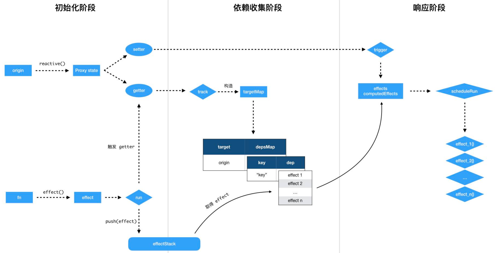
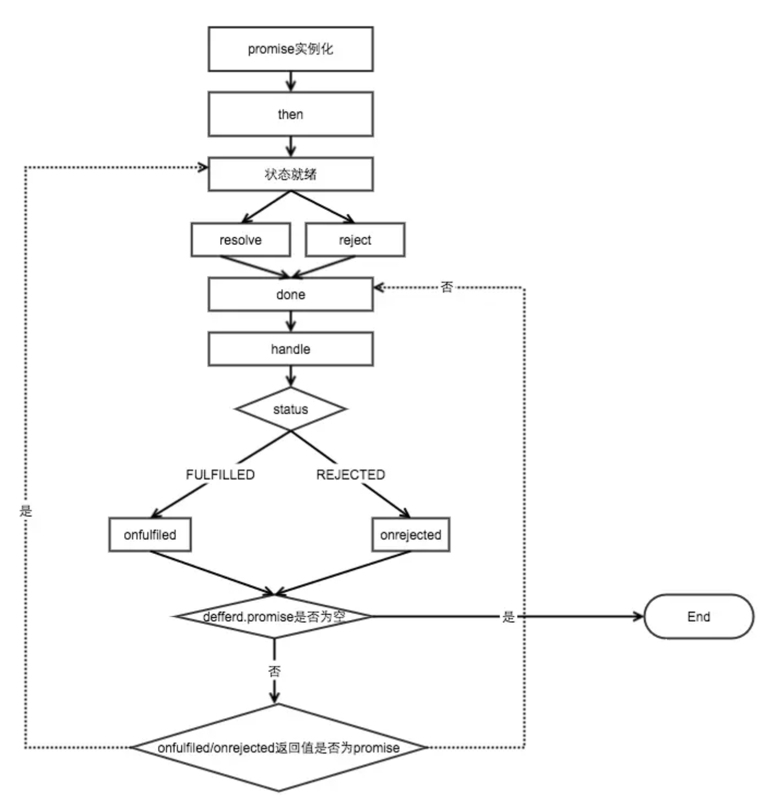

# interview - `es6-10` 新特性

[ES6 参考书](http://es6.ruanyifeng.com/)

[js 实现斐波那契数列 (数组缓存、动态规划、尾调用优化)](https://www.jianshu.com/p/bbc7e54a98d6)

## String
新方法
- `String.fromCodePoint()`: 弥补 `String.fromCharCode()`(从 Unicode 码点返回对应字符，但是这个方法不能识别码点大于 `0xFFFF` 的字符), 识别全部 Unicode, 和 `codePointAt()` 互反;
- `String.raw()`: 不对 `\n` 等转义字符转义(如换行等), 原样返回

### unicode
```js
'\u0061' // 'a'
'\u{6F}' // 'o'
"\u{20BB7}" // "𠮷"
let hello = 123; hell\u{6F}===123 // !!!
'\u{1F680}'==='\uD83D\uDE80'
'z'==='\z' ==='\172'==='\x7A'==='\u007A'==='\u{7A}'
```

### 字符串遍历 (可识别 UTF-16, for loop 不可以)
```js
for (let codePoint of 'foo') {
  console.log(codePoint) // "f", "o", "o"
}
```

### 原型方法 String.raw()

### 和 UTF-16 有关的新方法 `codePointAt(), normalize()`

### 新方法 `includes(), startsWith(), endsWith(), repeat(), padStart(), padEnd(), trimStart(), trimEnd(), matchAll()`

## Object
Object.freeze / Object.isFrozen

Object.seal / Object.isSealed: 密封一个对象，阻止添加新属性并将所有现有属性标记为不可配置。当前属性的值只要可写就可以改变。

拓展方法
```js
Ojbect.preventExtensions(o) // 禁止拓展
```

## Class

实现私有变量可以靠 `WeakMap` (无引用即被回收) 或 `Symbol`

## Reflect & Proxy
`Reflect`
1. **Object 语言内部方法**: 将 Object 对象的一些属于语言内部的方法如 `Object.defineProperty`, 放到 Reflect 对象上。现阶段，某些方法同时在 Object 和 Reflect 对象上部署，未来的新方法将只部署在 Reflect 对象上。也就是说，从 Reflect 对象上可以拿到语言内部的方法。
2. **Object 部分方法的返回值改变**: 让其变得更合理。比如，`Object.defineProperty(obj, name, desc)` 在无法定义属性时，会抛出一个错误，而 Reflect.defineProperty(obj, name, desc) 则会返回 `false`.
3. **object 操作函数化**: 如 `name in obj` -> `Reflect.has(obj, name)`, `delete obj[name]` -> `Reflect.deleteProperty(obj, name)`
4. **与 `Proxy` 方法一一对应**: 让 Proxy 对象可以方便地调用对应的 Reflect 方法，完成默认行为，作为修改行为的基础。也就是说，不管 Proxy 怎么修改默认行为，你总可以在 Reflect 上获取默认行为。

`Proxy`
- 修改某些操作的默认行为，等同于在语言层面做出修改，所以属于一种 “元编程”（meta programming），即对编程语言进行编程。
- 在目标对象之前架设一层 “拦截”，外界对该对象的访问，都必须先通过这层拦截，因此提供了一种机制，可以对外界的访问进行过滤和改写.

### 基本用法 basic usage
```js
p = new Proxy(target={}, handler={
  // 拦截: 对象属性的读取
  // !! 注意 target 对象属性设置, 如果一个属性不可配置（configurable）且不可写（writable），则 Proxy 不能修改该属性，否则通过 Proxy 对象访问该属性会报错。
  get(target, propKey, receiver) {
    console.log(`getting ${propKey}!`);
    return Reflect.get(target, propKey, receiver);
  },
  // 拦截: 该对象属性的设置
  // receiver 一般情况下是 p (Proxy 实例) 本身
  set(target, propKey, value, receiver) {
    console.log(`setting ${propKey}!`);
    return Reflect.set(target, propKey, value, receiver);
  },
  // 拦截: propKey in obj, 但不拦截 for...in, 不对迭代生效
  has(target, propKey) {},
  // 拦截: delete obj[propKey], Reflect.deleteProperty(target, prop)
  deleteProperty(target, propKey){
    // 例: 不允许删除
    // throw new TypeError()
  },
  // 拦截: p 作为函数调用的操作
  // proxy(...args)、proxy.call(object, ...args)、proxy.apply(...)
  apply(target, object, args){},
  // 拦截: new, p 作为构造函数调用的操作
  // 必须返回对象 (引用类型), 否则 TypeError
  construct(target, args, newTarget) {
    return new target(...args) // 默认行为
  },
  // 拦截 Object.defineProperty, Object.defineProperties
  // 优先度低于 writable, configurable
  // 返回 boolean, false 意味添加属性无法生效
  defineProperty(target, propKey, propDesc) {},
  //拦截 Object.keys(proxy), for...in, Object.getOwnPropertyNames(proxy), Object.getOwnPropertySymbols(proxy) 循环，返回一个数组。
  // 该方法返回目标对象所有自身的属性的属性名，而 Object.keys() 的返回结果仅包括目标对象自身的 可遍历 属性。
  ownKeys(target){},
  
  // ------------------- 非常用 --------------------
  // 拦截 Object/Reflect.getPrototypeOf(p), Object.prototype.isPrototypeOf(), Object.prototype.__proto__, instanceof
  // 返回一个对象。
  getPrototypeOf(target) {},
  // 拦截 Object.setPrototypeOf(proxy, proto)，
  // 返回一个布尔值。
  // 如果目标对象是函数，那么还有两种额外操作可以拦截。
  setPrototypeOf(target, proto) {},
  // 拦截 Object.preventExtensions(proxy)
  // 返回一个布尔值。
  preventExtensions(target) {},
  // 拦截 Object.isExtensible(proxy)
  // 返回一个布尔值
  isExtensible(target){},
  // 拦截 Object.getOwnPropertyDescriptor() (返回 defineProperty 的配置)
  // 返回 属性描述对象 或者 undefined
  getOwnPropertyDescriptor(target, key){
    if (key[0]==='_') return;
    return Object.getOwnPropertyDescriptor(target, key);
  },
});
```

### 用法举例
> 参考 [ES6-Proxy 与数据劫持](https://segmentfault.com/a/1190000019198822), [抱歉，学会 Proxy 真的可以为所欲为](https://zhuanlan.zhihu.com/p/35080324)

安全枚举类型, 用作 state machine action type
```js
export default function enum(object) {
  return new Proxy(object, {
    get(target, prop) { // 读取不存在属性时报错
      if (target[prop]) return Reflect.get(target, prop)
      throw new ReferenceError(`Unknown enum '${prop}'`)
    },
    set() { // 不能动态改变
      throw new TypeError('Enum is readonly')
    },
    deleteProperty() { // 不能删除
      throw new TypeError('Enum is readonly')
    }
  })
}
```
测试, 断言, 如监听函数调用情况
```js
function spy(spyFn) {
  spyFn.toBeCalledTimes = 0
  spyFn.lastCalledWith = undefined
  return new Proxy(spyFn, {
    apply(target, thisArg, argumentsList) {
      target.toBeCalledTimes += 1
      target.lastCalledWith = argumentsList.join(', ')
    }
  })
}
// 使用
spyApplyColor = spy(applyColor)
colors.forEach(color => spyApplyColor(color))
// 测试
expect(callback.toBeCalledTimes).toBe(colors.length)
expect(callback.lastCalledWith).toBe(colors[1])
```

数组
```js
let arr = [1,2,3,4]
let p=new Proxy(arr, {
  get(target, prop, receiver) {
    // 浏览器下无问题, 不需要判断
    // Node.js 下 过滤
    // Symbol(nodejs.util.inspect.custom)
    // Symbol(Symbol.toStringTag)
    // Symbol(Symbol.iterator)
    if (typeof prop!=='symbol') {
      let index = Number(prop);
      if (index<0) prop = String(target.length + index);
    }
    return Reflect.get(target, prop, receiver);
  },
  set(target, prop, value) {
    if (typeof prop!=='symbol' && !isNaN(Number(prop)))
      console.log(`set arr[${prop}]=${value}`)
    target[prop] = value
    return true
  }
})
p.push(5) // arr[4]=5
console.log(p, p[-1]) // [ 1, 2, 3, 4, 5 ] 5
```
表单校验
```js
let person = {
    name: 'xiaoming',
    age: 30
}
let handler = {
    set (target, key, value, receiver) {
      if (key==='name' && typeof value!=='string') {
        throw new TypeError('姓名是字符串')
      }
      if (key==='age') {
        if (typeof value!=='number'||value!==value<<0) throw new Error('年龄是正整数')
        if (value<0||value>150) throw new RangeError('年龄范围0-150')
      }
      return Reflect.set(target, key, value, receiver)
    }
}
let boy = new Proxy(person, handler)
boy.name = 'xiaohong' // OK
boy.age = '18' // 报错  用户年龄必须是数字类型
```
对嵌套属性的支持
```js
let obj = {
  info: {
    name: 'eason',
    blogs: ['webpack', 'babel', 'cache']
  }
}
let handler = {
  get (target, key, receiver) {
    console.log('get', key)
    // 递归创建并返回
    if (typeof target[key]==='object' && target[key]!==null) {
      return new Proxy(target[key], handler)
    }
    return Reflect.get(target, key, receiver)
  },
  set (target, key, value, receiver) {
    console.log('set', key, value)
    return Reflect.set(target, key, value, receiver)
  }
}
let proxy = new Proxy(obj, handler)
// 以下两句都能够进入 set
proxy.info.name = 'Zoe'
proxy.info.blogs.push('proxy')
```

### 没有 proxy 时 Object.defineProperty / Object.defineProperties
```js
// with its default value
Object.defineProperty(obj='target', prop='keyOrSymbol', descriptor={
  // whether is picked by Object.assign(), ...;
  // for non-Symbols, whether it is picked in for..in and Object.keys()
  enumerable: false,
  // can be deleted or its attributes can be changed, throw TypeError
  // cannot be reassigned
  // if true, can reassign enumerable
  configurable: false,
  // if false, the prop value cannot be changed, in strict mode throw TypeError 'prop is read-only'
  // cannot be reassigned
  writable: false,
  value: undefined,
  get() {},
  set() {},
})
```
区别
- `definedProperty` 的作用是劫持一个对象的属性，劫持属性的 `getter` 和 `setter` 方法，在对象的属性发生变化时进行特定的操作。而 Proxy 劫持的是整个对象。
- Proxy 会返回一个代理对象，我们只需要操作新对象即可，而 Object.defineProperty  只能遍历对象属性直接修改。
- `definedProperty` 不支持数组，更准确的说是不支持数组的各种 API。而 Proxy 可以支持数组的各种 API。
- 兼容性, Proxy 无法 polyfill

Vue3.0 应用


<hr>

## Symbol

```js
// create
a = Symbol('new') // new Symbol
Symbol({ a:1 }); // Symbol([object Object]), .toString()
new Symbol('new') // Uncaught TypeError: Symbol is not a constructor
Symbol.for('1')===Symbol.for('1') // create same symbol

// enum
obj = {
  key:'value',
  [Symbol('name')]:'symbol'
}
Object.getOwnPropertyNames(obj); // ["key"]
Object.keys(obj); // ["key"]
for (var i in obj) { console.log(i) } // key
Object.getOwnPropertySymbols(obj) // [Symbol(name)]
Reflect.ownKeys(obj) // ['key', Symbol(name)]
```
### 重要新增 symbol 属性

#### `Symbol.iterator`
```js
// 是否能遍历 + 使用 for...of (可遍历意味可展开)
const myIterable = {
  *[Symbol.iterator]() {
    yield 1;
    yield 2;
    yield 3;
  }
};
[...myIterable] // [1, 2, 3]
for (let v of myIterable) { console.log(v) } // 1, 2, 3
```

#### `Symbol.toPrimitive`
```js
let obj = {
  [Symbol.toPrimitive](hint) {
    switch (hint) {
      case 'number': // 需要转换为数值
        return 123;
      case 'string': // 需要转换为 string
        return 'str';
      case 'default': // 可以转成数值, 也可以转成 string
        return 'default';
      default:
        throw new Error();
     }
   }
};
2 * obj // 246
3 + obj // '3default'
obj == 'default' // true
String(obj) // 'str'
```

#### `Symbol.toStringTag`
影响 `Object.prototype.toString.call(o)` 的结果
```js
({[Symbol.toStringTag]: 'Foo'}.toString()) // 'Foo'
class Collection {
  get [Symbol.toStringTag]() {
    return 'xxx';
  }
}
let x = new Collection();
Object.prototype.toString.call(x) // "[object xxx]"
```

### 应用
- 因 JSON中不能保存 `Symbol`, 可用以防止 `xss`
  ```js
    // JSON
  let expectedTextButGotJSON = {
    type: 'div',
    props: {
      dangerouslySetInnerHTML: {
        __html: '/* put your exploit here */'
      },
    },
  };
  let message = { text: expectedTextButGotJSON };
  <p>{message.text}</p>
  ```
- React 判断有效 `ReactElement`
  ```js
  var REACT_ELEMENT_TYPE =
  (typeof Symbol==='function' && Symbol.for && Symbol.for('react.element')) ||
  0xeac7;
  ReactElement.isValidElement = function (object) {
    return typeof object==='object' && object!==null && object.$$typeof===REACT_ELEMENT_TYPE;
  };
  ```
- 因其不可枚举, 可用作私有属性, 如 `[Symbol.toPrimitive]`, `[Symbol.Iterator]`
  ```js
  const privateField = Symbol();
  class myClass {
    constructor(){
      this[privateField] = '';
    }
    getField(){
      return this[privateField];
    }
    setField(val){
      this[privateField] = val;
    }
  }
  ```
- 防属性/键值碰撞

## Function
### name

```js
var f = function () {};
var ff = f
// ES5
f.name // ""
// ES6
f.name // "f"
ff.name // 'f'
(new Function).name // "anonymous"
function foo() {};
foo.bind({}).name // "bound foo"
(function(){}).bind({}).name // "bound "
```

### 参数默认值, ...rest
- 对 `length` (函数预期传入的参数个数) 的影响: 指定默认值的参数及之后的参数都不计入, `...` 参数也不会计入。
```js
(function (a, b = 5, c) {}).length // 1
(function (a, ...args) {}).length // 1
```
- 对 `作用域`, 一旦设置了参数的默认值，函数进行声明初始化时，参数会形成一个单独的作用域（context）。等到初始化结束，这个作用域就会消失。这种语法行为，在不设置参数默认值时，是不会出现的。
```js
var x = 1;
(function f(x, y = x) {
  console.log(y);
})(2) // 2
(function f(y = x) {
  let x = 2;
  console.log(y);
})() // 1
(function foo(x = x) {})() // ReferenceError: x is not defined
// 上面代码 "x = x" 形成一个单独作用域。实际执行的是 let x = x，由于暂时性死区，这行代码会报错 ”x 未定义 “。
(function foo(x, y = function() { x = 2; }) {
  var x = 3;
  y();
  console.log(x);
})() // 3
x // 1
```

## JS Collection 集合
> [初学者应该了解的数据结构：Array、HashMap 与 List](https://juejin.im/post/5b3731b36fb9a00e5326f087#heading-21)
## Array
```js
.from(arrayLike) // convert arrayLike to array
```
Q & A
```js
// Reflect 会返回 symbol 属性 key, getOwnPropertyNames 会返回不可枚举的属性 key
Reflect.ownKeys(obj).length ≥ Object.getOwnPropertyNames(obj).length ≥ Object.keys(obj).length
```

`Proxy` 可以实现很多以前只有魔改 JS 引擎底层才能实现的效果，请找出下面是利用 Proxy 实现了的神奇效果：

A. 原型就是自己的对象 —— Object.getPrototypeOf(obj)===obj // true

B. 任意属性都存在的对象 ——  "任意名字的属性" in obj // true

C. 任意值都是它的实例的对象，甚至 null 和 undefined  ——  undefined instanceof obj // true

D. 用 Object.prototype.toString() 检测出来的对象类型是 haha 的对象  —— Object.prototype.toString.call(obj)==="[object haha]" // true

E. 一元加后的值与加 0 后的值分别恒等于两个不同的数字  ——  比如 +obj 始终===1，但 obj + 0 始终等于===10

F. 亦假又亦真的对象  ——  if (obj) {alert("执行不到")} 但 if (obj.length) {alert("能执行到")}

参考答案：AB

A:
```js
obj = new Proxy({}, {getPrototypeOf(){return obj}})
```
B:
```js
obj = new Proxy({}, {has(){return true}})
```
C:
```js
obj = {[Symbol.hasInstance](){return true}}
```
D:
```js
obj = {[Symbol.toStringTag]: "haha"}
```
E:
```js
obj = {[Symbol.toPrimitive](hint){return hint==="number" ? 1 : 10}} 
```

F: `document.all` 具有其性质

## Promise

[实现](https://github.com/forthealllight/promise-achieve/blob/master/myPromise.js)<br>
[实现2](https://juejin.im/post/5b83cb5ae51d4538cc3ec354)


实现要点
- status = 'pending' | 'resolved' | 'rejected';
- value = undefined, reason = undefined, 分别在 resolve / reject 后赋值给参数
- onFullfilledArray = [], onRejectedArray = [], 分别在 resovle / reject 时依次执行
- resolve 后 return 一个 myPromise
- 入参检查 (resolve, reject)
- then 绑在 prototype 上, 用递归把 全部 then 的回调绑在 onFullfilledArray, onRejectedArray 上
- 定义 resolvePromise

注意事项
- 在 Pending 转为另外两种之一的状态时候，状态不可在改变..
- Promise 的 then 为异步。而 (new Promise()) 构造函数内为同步
- Promise 的 `catch` **不能捕获任意情况的错误** (比如 then 里面的 setTimout 内手动抛出一个 Error)
- Promise 的 then 返回 Promise.reject() 会中断链式调用
- Promise 的 resolve 若是传入值而非函数，会发生值穿透的现象
- Promise 的 `catch, then`,return 的都是一个新的 `Promise`(在 Promise 没有被中断的情况下)

## Generator

## [for...in vs for of](https://www.jianshu.com/p/c43f418d6bf0)
### 对象用 for...in
通常用 `for...in` 来遍历对象的键名
- 可以遍历到对象的原型方法及继承自原型链上的属性/方法, 如果不想遍历原型方法和属性的话，可以在循环内部判断一下, `hasOwnPropery` 方法可以判断某属性是否是该对象的实例属性
- 如用来遍历数组, 则会返回非期望结果, 如以下会多返回 `method`, `name`
  ```js
  Array.prototype.method=function(){
  　　console.log(this.length);
  }
  var myArray=[1,2,4,5,6,7]
  myArray.name="数组"
  for (var index in myArray) {
    console.log(myArray[index]); // 返回 name, method
  }
  ```

### 迭代器用 for...of
`for of` 适用遍历数 / 数组对象 / 字符串 /map/set 等拥有迭代器对象的集合。但是不能遍历对象，因为没有迭代器对象。与 `forEach()` 不同的是，它可以正确响应 break、continue 和 return 语句

所有拥有 `Symbol.iterator` 的对象被称为可迭代的。可迭代对象的概念几乎贯穿于整门语言之中，不仅是 `for of` 循环，还有 Map 和 Set 构造函数、解构赋值，以及新的展开操作符。

`for...of` 循环首先调用集合的 `Symbol.iterator 方法`，紧接着返回一个 `新的迭代器对象`。迭代器对象可以是任意具有.next () 方法的对象; `for...of` 循环将重复调用这个方法，每次循环调用一次。
```js
var zeroesForeverIterator = {
  [Symbol.iterator]: function () {
   return this;
  },
  next: function () {
    return { done: false, value: 0 };
  }
};
```
