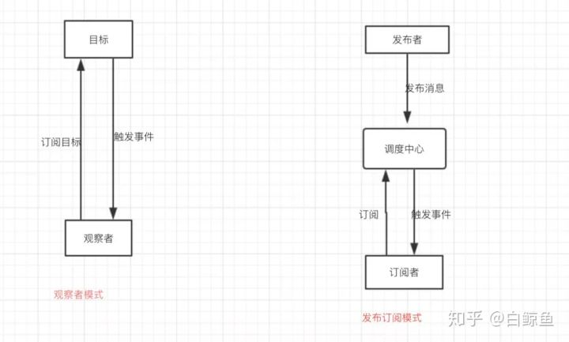
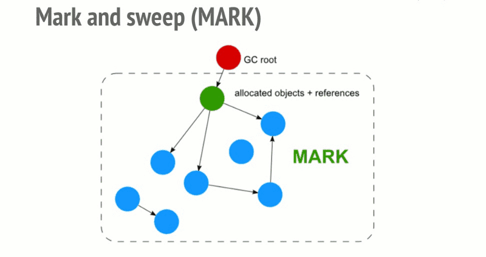
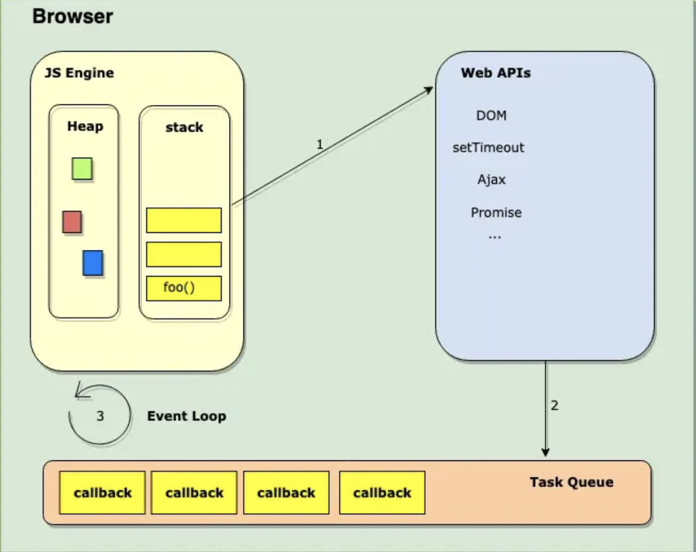

# JS 语言基础
## [V8](https://github.com/qq449245884/xiaozhi/issues/2)

## 类型
[基本数据类型 primitive](https://developer.mozilla.org/en-US/docs/Glossary/Primitive)：
Null Undefined Boolean String Number Symbol BigInt

引用数据类型: 对象 Object
- 一般对象 - Object
- 数组对象 - Array
- 正则对象 - RegExp
- 日期对象 - Date
- 数学函数 - Math (浏览器全局对象)
- 函数对象 - Function

`typeof` 可以判断 primitive, 不适合判断引用数据类型 object
对一个值使用 typeof 操作符可能会返回下列某个字符：
- “undefined”：如果这个值未定义
- “boolean”：如果这个值是布尔值
- “number”：如果这个值是数值
- “string”：如果这个值是字符串
- “object”：如果这个值是 对象 或 Array 或 null
- “function”：如果这个值是函数

`instanceof` 是查询原型链，因此不适合判断 primitive 类型。

```js
var str1 = 'hello world';
str1 instanceof String // false
```

判断对象（object）的类型最好用 `Object.prototype.toString.call`
Object.prototype.toString.call(arg)==="[object Array]"

instanceof 可以借助 Symbol 判断 primitive 类型：

```js
class PrimitiveNumber {
  static [Symbol.hasInstance](x) {
    return typeof x === 'number'
  }
}
console.log(111 instanceof PrimitiveNumber) // true
```

## Number 数值

最小的数值为：Number.MIN_VALUE，在大多数浏览器中该数值为 5e-324；
最大的数值为：Number.MIN_VALUE ，在大多数浏览器中该数值为 1.7976931348623157e+308

如果某次计算的结果值超出了数值范围，就会转换成特殊的 Infinity 值（ -Infinity 负无穷或 Infinity 正无穷）

可以使用 isFinite () 函数判断是否为无穷数。

有三个函数可以把非数值转换为数值：

- Number()
- parseInt()
- parseFloat()

Number () 可以用于任何数据类型，parseInt 和 parseFloat 专门用于把字符串转换成数值

Number () 函数在转换时规则比较复杂且不够合理，所以更常用的是 parseInt () 函数

parseInt () 函数在转换字符串时有几个规则
- 它会忽略字符串前面的空格，直至找到第一个非空字符串。
- 如果第一个字符不是数字字符或负数，parseInt () 就会返回 NaN。
- 如果第一个字符是数字字符，parseInt 会继续解析第二个字符，知道解析完所有的字符或遇到一个非数字字符。
- 可以在转换时，指定第二个参数即转换使用的基数（即多少进制），来消除 parseInt () 在进制方面的困惑。

```js
var num1 = parseInt("10", 2);   // 2（二进制）
var num2 = parseInt("10", 8);   // 8（八进制）
var num3 = parseInt("10", 10);  // 10（十进制）
var num4 = parseInt("10", 16);  // 16（十六进制）
```

parseFloat 也会从第一个字符开始解析每个字符，也是一直解析到字符末尾，或者解析到遇见一个无效的浮点数字字符为止。也就是说第一个小数点是有效的，第二个就是无效的，后面的字符会被忽略。

parseFloat 还有一个特点是会忽略前导的零。它只能解析十进制数值

## String 字符串
字符字面量 escape value
- \n：换行
- \t：横向tab缩进
- \v: 纵向缩进
- \b：退格
- \r：回车
- \f：换页
- \：换行再续string，不一定被广泛支持，弃用

## ==, ===

"==" 两边的类型是否相同，相同的话就比较值的大小，例如 1==2，返回 false
 判断的是否是 null 和 undefined，是的话就返回 true
 判断的类型是否是 String 和 Number，是的话，把 String 类型转换成 Number，再进行比较
判断其中一方是否是 Boolean，是的话就把 Boolean 转换成 Number，再进行比较
如果其中一方为 Object，且另一方为 String、Number 或者 Symbol，会将 Object 转换成字符串，再进行比较

因此

```js
[]==![] // [] -> 0, ![] -> false -> 0
{a: 1} == "[object Object]") //true

Object.is(NaN, NaN) // true
Object.is(+0, -0) // false

```

## 计算

### 位运算符 (bitwise operator)

[我们要不要在 JS 使用二进制位运算？](https://juejin.im/entry/57317b2679df540060d5d6c2)
首先对性能基本没有负面影响, 纯数字计算更快, 但只能对 Number 使用

`&` 按位与

`|` 按位或

`^` 按位异或

`~` 按位非

`<<` 左移

`>>` 有符号右移

`>>>` 无符号右移

位运算时对非 `整数` 需先转化为 `Int32` 型整数

#### 位运算符在 js 中的妙用
判断奇偶
```js
// 偶数 & 1 = 0
// 奇数 & 1 = 1
console.log(2 & 1)    // 0
console.log(3 & 1)    // 1
```
使用 `~, >>, <<, >>>, |` 取整
```js
console.log(~~ 6.83)    // 6
console.log(6.83 >> 0)  // 6
console.log(6.83 << 0)  // 6
console.log(6.83 | 0)   // 6, 或随机数取整
// >>>不可对负数取整
console.log(6.83 >>> 0)   // 6
```
使用 `^` 完成值交换  
```js
var a = 5
var b = 8
a ^= b
b ^= a
a ^= b
console.log(a)   // 8
console.log(b)   // 5
```
Linux 权限检查/验证 | 碰撞检测优化 | React effectTag
```js
// 授权时
r = 1|2|4|8
// 鉴权时
r & 4 // 如有权则返回4,否则0
```

<details>
<summary>
大数相加：</summary>
1. 如有小数点，记录各自的小数点后位（如 11.12+34 为 2 0）后，去掉变为整数，补齐空位 （11.12+34 -> 1112+3400）
2. 如有负值，第4步为减法
3. 转化为string并倒转
4. 遍历各对应位置位求和，满十后一位（用临时值）进一【减法若不够则后一位退一】，逢缺位结束并附上另一数多出的数位
5. 倒转，加回小数点
</details>
<hr>
## 闭包

缺点是引用始终存在，占用内存

## 原型链继承
1. 类属性使用 `this` 绑定
2. 类方法使用 `prototype` 对象来绑定
3. 为了继承属性， 使用 `call` 函数来传递 this
4. 为了继承方法，使用 `Object.create` 连接父和子的原型
5. 始终将子类构造函数设置为自身，以获得其对象的正确类型
```js
// 1.
function Animal(name, type) {
  this.name = name;
  this.type = type;
}
// 2.
Animal.prototype.shout = function () { return this.name + ' shout' }
// 3.
function Dog(name, type) {
Animal.call(this, name, type);
this.sound = 'bow';
}
// 4. Link prototype chains to inherit parent class functions
Dog.prototype = Object.create(Animal.prototype);
// 5. target the constructor to itself
Dog.prototype.constructor = Dog;
```

## 作用域 + 基本变量
块级作用域: let, const, if, function 等

暂时性死区

`window, document`: window 对象是指浏览器打开的窗口。document 对象是 HTML 文档对象的一个只读引用，window 对象的一个属性

### 高度/宽度
> https://segmentfault.com/a/1190000010746091

1. `document.documentElement.clientWidth / clientHeight`: 屏幕可视区域的宽高, 不含滚动条和工具条
2. `window.innerWidth / innerHeight`: 可视区域的宽高
3. `window.outerWidth / outerHeight`: `innerWidth` 加上相应的工具条和滚动条窗口
4. `screen.availWidth / availHeight`: 屏幕的可用宽高, 如 mac 下顶部状态工具栏高 23px, `availHeight` = monitorResolution - 23px

以下为 DOMElement 所拥有

5. `clientWidth / clientHeight`: 内容的宽高
6. `offsetHeight / offsetWidth`: e.g. `document.body.offsetHeight`, DOM 元素本身的宽高, 如长段文字会超出屏幕
7. `offsetLeft / offsetTop`: 所有 HTML 元素拥有 offsetLeft 和 offsetTop 属性来返回元素的 X 和 Y 坐标
   1. 相对于已定位元素的后代元素和一些其他元素（表格单元），这些属性返回的坐标是相对于父元素
   2. 一般元素，则是相对于文档，返回的是文档坐标
   3. `offsetParent` 指其相对的父元素, `null` 表示是一般元素, Left/Top 为相对文档坐标.
8. `scrollWidth / scrollHeight`: 元素的内容区域加上内边距，在加上任何溢出内容的尺寸.<br>没有溢出时 = `client*`, 溢出时 = `offset*`
9. `scrollLeft & scrollTop`: 元素的滚动条的位置, 修改其让元素中的内容滚动

## 常用函数实现

### String
String.`trim`
```js
str => str.replace(/(^\s+)|(\s+$)/g, '')
```

### Array
```js
// Array shared verification
if (this == null) {
  throw new TypeError(" this is null or not defined");
}
if (Object.prototype.toString.call(fn) != "[object Function]") {
  throw new TypeError(fn + " is not a function");
}
```
Array.`map`
```js
Array.prototype._map = function(fn, thisArg) {
  const arr = this
  let T
  if (thisArg) T = thisArg
  const res = []

  const l = arr.length
  for(let i = 0; i<l; i++) {
    const r = fn.call(T, arr[i], i, arr)
    res.push(r)
  }
  return res
}
```
Array.`reduce`
```js
// if reduceRight, amend i
Array.prototype._reduce = function(fn, initValue) {
  const arr = this
  const len = arr.length
  let r = arr[0]
  let i = 0
  if (typeof initValue !== 'undefined') {
    r = initValue
    i--
  }
  while(++i<len) {
    r = fn(r, arr[i], i, arr)
  }
  return r
}
```
Array.`filter`
```js
Array.prototype._filter = function(fn, thisArg) {
  const arr = this
  const len = arr.length
  const res = []
  let i = -1
  while (++i<len) {
    const r = fn.call(thisArg, arr[i], i, arr)
    if (r) res.push(arr[i])
  }
  return res
}
```
Array.`flat`
```js
flat = arr => {
  var res = []
  arr.forEach(e => {
    if (Array.isArray(e)) res.push(...flat(e))
    else res.push(e)
  })
  return res
}
```

### lodash / underscore
`curry`
```js
// e.g. sum, hint: use arguments.length
const sum = (a, b=0) => {
  if (arguments.length === 0) return b
  return n => {
    let res = a+b
    return sum(n, res)
  }
}
console.log(sum(100,200)(300)(400)())
```
underscore.`debounce`
> 不管触发了多少次回调，只认最后一次
```js
// Returns a function, that, as long as it continues to be invoked, will not
// be triggered. The function will be called after it stops being called for
// N milliseconds. If `immediate` is passed, trigger the function on the
// leading edge, instead of the trailing.
function debounce(func, wait, immediate) {
  var timeout;
  return function() {
    var context = this, args = arguments;
    var later = function() {
      timeout = null;
      if (!immediate) func.apply(context, args);
    };
    var callNow = immediate && !timeout;
    clearTimeout(timeout);
    timeout = setTimeout(later, wait);
    if (callNow) func.apply(context, args);
  };
};
```
naive.`throttle`
```js
var throttle = function(fn, wait){
  var last = 0
  return function(){
    var curr = +new Date()
    if (curr-last>wait || !last){
      fn.apply(this, arguments)
      last = curr
    }
  }
}
```
underscore.`throttle`
> 在某段时间内，不管触发了多少次回调，都只认第一次，并在计时结束时给予响应。
```js
// Returns a function, that, when invoked, will only be triggered at most once
// during a given window of time. Normally, the throttled function will run
// as much as it can, without ever going more than once per `wait` duration;
// but if you'd like to disable the execution on the leading edge, pass
// `{leading: false}`. To disable execution on the trailing edge, ditto.
function(func, wait, options) {
  var timeout, context, args, result;
  var previous = 0;
  if (!options) options = {};

  var later = function() {
    previous = options.leading === false ? 0 : Date.now();
    timeout = null;
    result = func.apply(context, args);
    if (!timeout) context = args = null;
  };

  var throttled = function() {
    var now = Date.now();
    if (!previous && options.leading === false) previous = now;
    var remaining = wait - (now - previous);
    context = this;
    args = arguments;
    if (remaining <= 0 || remaining > wait) {
      if (timeout) {
        clearTimeout(timeout);
        timeout = null;
      }
      previous = now;
      result = func.apply(context, args);
      if (!timeout) context = args = null;
    } else if (!timeout && options.trailing !== false) {
      timeout = setTimeout(later, remaining);
    }
    return result;
  };

  throttled.cancel = function() {
    clearTimeout(timeout);
    previous = 0;
    timeout = context = args = null;
  };

  return throttled;
};
```
`EventEmitter`
```js
// https://zhuanlan.zhihu.com/p/60324936
class EventEmitter {
  constructor() {
    this.listeners = {}
    // this.maxLength = 10
  }

  on(type, cb) {
    let fns = (this.listeners[type] = this.listeners[type] || [])
    if (!fns.includes(cb)) {
      fns.push(cb)
    }
    return this
  }
  // removeListener + removeAllListener
  off(type, cb) {
    let fns = this.listeners[type]
    if (Array.isArray(fns)) {
      if (typeof cb === 'function') {
        const i = fns.indexOf(cb)
        if (i!==-1) fns.splice(i, 1)
      } else fns.length = 0
    }
    return this
  }

  once(type, cb) {
    const self = this;
    function fn() {
      var args = Array.prototype.slice.call(arguments);
      self.listeners.apply(null, args);
      self.off(event, fn);
    }
    this.on(event, fn)
  }

  emit(type, args) {
    let fns = this.listeners[type]
    if (Array.isArray(fns)) {
      fns.forEach(fn => fn(args))
    }
    return this
  }
}
```
`delegate` 事件委托
```js
// hint: 绑定父元素, 通过 `e.target.nodeName` 限定委托元素 e.target
document.addEventListener('DOMContentLoaded', function() {
  let app = document.getElementById('todo');
  app.addEventListener('click', function(e) {
    if (e.target && e.target.nodeName === 'LI') {
      let item = e.target;
      alert('you clicked on item: ' + item.innerHTML)
    }
  })
})
```
`Function.bind`
```js
// polyfill
// see full in https://developer.mozilla.org/en-US/docs/Web/JavaScript/Reference/Global_objects/Function/bind#Polyfill
// Does not work with `new funcA.bind(thisArg, args)`
if (!Function.prototype.bind) (function(){
  var slice = Array.prototype.slice;
  Function.prototype.bind = function() {
    var thatFunc = this, thatArg = arguments[0];
    var args = slice.call(arguments, 1);
    if (typeof thatFunc !== 'function') {
      // closest thing possible to the ECMAScript 5
      // internal IsCallable function
      throw new TypeError('Function.prototype.bind - ' +
        'what is trying to be bound is not callable');
    }
    return function(){
      var funcArgs = args.concat(slice.call(arguments))
      return thatFunc.apply(thatArg, funcArgs);
    };
  };
})();
```

### `new fn()` 操作代码化演示

```js
var obj = {}; // new 操作符为我们创建一个新的空对象，由此 this 重定向至新对象
obj.__proto__ = fn.prototype; // 空对象的原型指向函数的原型
fn.call(obj);  // 改变构造函数内部的 this 的指向
```

### `this`, `arguments` 和 `call, apply, bind`
this 指向 错误
```js
const arrayLike = { length: 0 }
const call = [].push.call; // typeof call "function"
call(arrayLike, 1);
console.log(arrayLike); // call is not a function
// because "this" inside `call` points to global "this", thus there is no `call` on window/global/globalThis.
```

arguments
> https://www.cnblogs.com/yugege/p/5539020.html

我们现在有这样的一个需求，有一个 people 对象，里面存着一些人名，如下：
```js
var people = {
  values: ["Dean Edwards", "Sam Stephenson", "Alex Russell", "Dean Tom"]
};
```
我们希望 people 对象拥有一个 `find` 方法，当不传任何参数时，就会把 people.values 里面的所有元素返回来；当传一个参数时，就把 first-name 跟这个参数匹配的元素返回来；当传两个参数时，则把 first-name 和 last-name 都匹配的才返回来。因为 find 方法是根据参数的个数不同而执行不同的操作的，所以，我们希望有一个 addMethod 方法，能够如下的为 people 添加 find 的重载：

```js
addMethod(people, "find", function() {}); /*不传参*/
addMethod(people, "find", function(a) {}); /*传一个*/
addMethod(people, "find", function(a, b) {}); /*传两个*/
```
这时候问题来了，这个全局的 addMethod 方法该怎么实现呢？John Resig 的实现方法如下，代码不长，但是非常的巧妙：
```js
function addMethod(object, name, fn) {
　var old = object[name]; //把前一次添加的方法存在一个临时变量old里面
　object[name] = function() { // 重写了object[name]的方法
　　// 如果调用object[name]方法时，传入的参数个数跟预期的一致，则直接调用
　　if(fn.length === arguments.length) { // Function.prototype.length 是参数的个数!
　　  return fn.apply(this, arguments);
　　　// 否则，判断old是否是函数，如果是，就调用old
　　} else if(typeof old === "function") {
　　　return old.apply(this, arguments);
　　}
　}
}
```

### 观察者模式 发布订阅模式
> https://zhuanlan.zhihu.com/p/60324936

观察者模式：
> 它定义了对象间的一种一对多的关系，让多个观察者对象同时监听某一个主题对象，当一个对象发生改变时，所有依赖于它的对象都将得到通知。<br>
观察者模式在前端开发中非常常用， 我们经常用的事件就是观察者模式的一种体现，它对我们解耦模块，开发基于消息的业务起着非常重要的作用。


从图中可以看出，观察者模式中观察者和目标直接进行交互，而发布订阅模式中统一由调度中心进行处理，订阅者和发布者互不干扰。

观察者模式的订阅者与发布者之间是存在依赖的，而发布/订阅模式则不会。

发布 / 订阅模式优势在于， 这样一方面实现了解耦，还有就是可以实现更细粒度的一些控制。比如发布者发布了很多消息，但是不想所有的订阅者都接收到，就可以在调度中心做一些处理，类似于权限控制之类的。还可以做一些节流操作。

观察者 代码
```js
class Observer {
  constructor() { }
  update(val) {
    //
  }
}
// 观察者列表
class ObserverList {
  constructor() {
    this.observerList = []
  }
  add(observer) {
    return this.observerList.push(observer);
  }
  remove(observer) {
    this.observerList = this.observerList.filter(ob => ob !== observer);
  }
  count() {
    return this.observerList.length;
  }
  get(index) {
    return this.observerList(index);
  }
}
// 目标
class Subject {
  constructor() {
    this.observers = new ObserverList();
  }
  addObserver(observer) {
    this.observers.add(observer);
  }
  removeObserver(observer) {
    this.observers.remove(observer);
  }
  notify(...args) {
    let obCount = this.observers.count();
    for (let index = 0; index < obCount; index++) {
      this.observers.get(i).update(...args);
    }
  }
}
```
订阅发布 PubSub 代码
```js
class PubSub {
  constructor() {
    this.subscribers = {}
  }
  subscribe(type, fn) {
    let listeners = this.subscribers[type] || [];
    listeners.push(fn);
  }
  unsubscribe(type, fn) {
    let listeners = this.subscribers[type];
    if (!listeners || !listeners.length) return;
    this.subscribers[type] = listeners.filter(v => v !== fn);
  }
  publish(type, ...args) {
    let listeners = this.subscribers[type];
    if (!listeners || !listeners.length) return;
    listeners.forEach(fn => fn(...args));
  }
}

let ob = new PubSub();
ob.subscribe('add', (val) => console.log(val));
ob.publish('add', 1);
```
观察者模式由具体目标调度，每个被订阅的目标里面都需要有对观察者的处理，会造成代码的冗余。而发布订阅模式则统一由调度中心处理，消除了发布者和订阅者之间的依赖。

<hr>

### 为什么 javascript 是单线程的

首先是历史原因，在创建 javascript 这门语言时，多进程多线程的架构并不流行，硬件支持并不好。<br>
其次是因为多线程的复杂性，多线程操作需要加锁，编码的复杂性会增高。<br>
而且，如果同时操作 DOM ，在多线程不加锁的情况下，最终会导致 DOM 渲染的结果不可预期。

当 JS引擎线程执行时 GUI渲染线程会被挂起，GUI 更新则会被保存在一个队列中等待 JS引擎线程空闲时立即被执行。

### 宏任务 & 微任务
我们可以将每次执行栈执行的代码当做是一个`宏任务`（包括每次从事件队列中获取一个事件回调并放到执行栈中执行），
每一个宏任务会从头到尾执行完毕，不会执行其他。

我们前文提到过 JS 引擎线程和 GUI 渲染线程是互斥的关系，浏览器为了能够使 宏任务和 DOM 任务有序的进行，会在一个 `宏任务` 执行结果后，在下一个 `宏任务` 执行前， GUI渲染线程开始工作，对页面进行渲染。

**主代码块，setTimeout，setInterval 等，都属于宏任务**
<hr>
宏任务结束后，会执行渲染，然后执行下一个 宏任务，而微任务可以理解成在当前 宏任务执行后立即执行的任务。

也就是说，当宏任务执行完，会在**渲染前**，将执行期间所产生的所有微任务都执行完。

**Promise，process.nextTick 等，属于 微任务。**

```js
document.body.style = 'background:blue'
console.log(1);
Promise.resolve().then(()={
  console.log(2);
  document.body.style = 'background:black'
});
console.log(3);
```

会打印132，直接变成黑色，因为 Promise 属于微任务，**在渲染前先执行**。

```js
setTimeout(() = {
  console.log(1)
  Promise.resolve(3).then(data = console.log(data))
}, 0)
setTimeout(() = {
  console.log(2)
}, 0)
// print : 1 3 2
```

上面代码共包含两个 setTimeout ，也就是说除主代码块外，共有两个宏任务，
其中第一个宏任务执行中，输出 1 ，并且创建了微任务队列，所以在下一个宏任务队列执行前，
先执行微任务，在微任务执行中，输出 3 ，微任务执行后，执行下一次宏任务，执行中输出 2

#### 宏任务微任务 顺序总结
- 执行一个 `宏任务`（栈中没有就从事件队列中获取）
- 执行过程中如果遇到 `微任务`，就将它添加到微任务的任务队列中
- 宏任务执行完毕后，立即执行当前 微任务队列中的所有 微任务（依次执行）
- 当前 宏任务执行完毕，开始检查渲染，然后 GUI线程接管渲染
- 渲染完毕后， JS线程继续接管，开始下一个 `宏任务`（从事件队列中获取）


测试：输出结果

```js
async function a1 () {
  console.log('a1 start')
  await a2()
  console.log('a1 end')
}
async function a2 () {
  console.log('a2')
}

console.log('macro1')

setTimeout(() => {
  console.log('setTimeout')
}, 0)

Promise.resolve().then(() => {
  console.log('promise1')
})

a1()

let promise2 = new Promise((resolve) => {
  resolve('promise2.then')
  console.log('promise2')
})

promise2.then((res) => {
  console.log(res)
  Promise.resolve().then(() => {
      console.log('promise3')
  })
})
console.log('macro2')
```

> macro1, a1 start, a2, promise2, macro2, promise1, a1 end, promise2.then, promise3, setTimeout

#### [Promise 顺序总结 必看](https://juejin.im/post/5dc028dcf265da4d4b5fe94f)
理解 `Promise` 的注册时机和执行时机
注意: `Promise.resolve()` (resolve 无 value) 按 A+ 实现时为 `完全同步代码` (return UNDEFINED), 但在 webkit 上实现为新建一个 `Promise` (resolved and return undefined), 因此会影响任务的注册和执行时机
> 核心原因是第一次 new Promise 的时候，他接着入栈了一个 undefined value，导致需要多执行一次的 undefined 的 then 回调。  
isolate->factory ()->undefined_value ()

#### setTimeout
`setTimeout` 在控制台会返回一个 id.

### 垃圾回收
> https://github.com/qq449245884/xiaozhi/issues/3

垃圾回收为 `后台` `进程`

垃圾 = 没有被引用的对象 / 根访问不到的循环引用 (引用计数法无法清除)

基础: 标记清除 (mark and sweep)
1. 构建 “根” (gc root, window/global/globalThis)，保存引用的全局变量。
2. 检查所有根及其子节点，标记为活动的。任何根不能到达的地方都将被标记为垃圾。
3. 释放所有未标记到的内存块，并将该内存返回给操作系统。


优化
- 分代回收
- 增量回收
- 只在 CPU 闲时收集

常见内存泄漏
- 误修改全局变量
- 被遗忘的定时器和回调
- 闭包
- 脱离 DOM 的引用 (可使用 WeakMap 避免)

### 依赖注入

## QA

Q: 求 [1, 10, 11, -1,'-5',12, 13, 14, 15, 2, 3, 4, 7, 8, 9] 内最大值与最小值之差:

A:  
  ```js
  function MaxMinPlus(arr) {
    // 返回最大值与最小值之差
    return Array.isArray(arr) ? Math.max.apply(Math, arr) - Math.min.apply(Math, arr) : console.log('err')
  }
  ```
Q: [如果我们在浏览器控制台中运行 'foo' 函数，是否会导致堆栈溢出错误？](https://juejin.im/post/5d2d146bf265da1b9163c5c9#heading-3)
  ```js
  function foo() {
    setTimeout(foo, 0); // 是否存在堆栈溢出错误?
  };
  ```
A: 不会.

JavaScript 并发模型基于 “事件循环”。 当我们说 “浏览器是 JS 的家” 时我真正的意思是浏览器提供运行时环境来执行我们的 JS 代码。
浏览器的主要组件包括 `调用堆栈`，`事件循环`，`任务队列` 和 `Web API`。 像 `setTimeout`, `setInterval` 和 `Promise` 这样的全局函数不是 JavaScript 的一部分，而是 Web API 的一部分。 JavaScript 环境的可视化形式如下所示：



JS 调用栈是后进先出 (LIFO) 的。引擎每次从堆栈中取出一个函数，然后从上到下依次运行代码。每当它遇到一些异步代码，如 setTimeout，它就把它交给 Web API(箭头 1)。因此，每当事件被触发时，callback 都会被发送到任务队列（箭头 2）。
事件循环 (Event loop) 不断地监视任务队列 (Task Queue)，并按它们排队的顺序一次处理一个回调。每当调用堆栈 (call stack) 为空时，Event loop 获取回调并将其放入堆栈 (stack)(箭头 3) 中进行处理。请记住，如果调用堆栈不是空的， 则事件循环不会将任何回调推入堆栈。

Q:

A:
