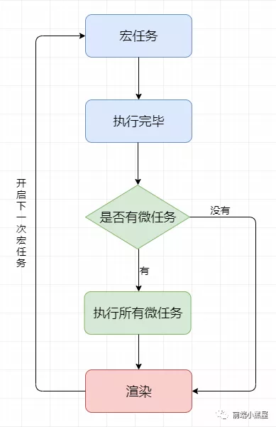

# JS 语言基础
## [语言标准制定, 演变](https://juejin.im/post/5dfa5cb86fb9a0165721db1d)

## [JSCore](https://ming1016.github.io/2018/04/21/deeply-analyse-javascriptcore/)

### [V8](https://github.com/qq449245884/xiaozhi/issues/2)
- hidden class infer 隐藏类型推断
- inline cache 缓存之前查找地址的结果

JS Engine flow:

js source -> parser -> abstract syntax tree -> compiler / interpreter (AOT, JIT) -> machine code

### [内存分配](http://www.conardli.top/blog/article/JS%E8%BF%9B%E9%98%B6/%E4%BD%A0%E7%9C%9F%E7%9A%84%E6%8E%8C%E6%8F%A1%E5%8F%98%E9%87%8F%E5%92%8C%E7%B1%BB%E5%9E%8B%E4%BA%86%E5%90%97%EF%BC%88%E4%B8%80%EF%BC%89%E6%95%B0%E6%8D%AE%E7%B1%BB%E5%9E%8B.html)
原始类型 放 `栈内存`
- 存储的值大小固定
- 空间较小
- 可以直接操作其保存的变量，运行效率高
- 由系统自动分配存储空间

引用类型 放 `堆内存`
- 存储的值大小不定，可动态调整
- 空间较大，运行效率低
- 无法直接操作其内部存储，使用引用地址读取
- 通过代码进行分配空间
<hr>

## 类型
[基本数据类型 primitive](https://developer.mozilla.org/en-US/docs/Glossary/Primitive)：
Null Undefined Boolean String Number Symbol BigInt

引用数据类型: 对象 Object
包含 Array, Function, RegExp, Date, Math, *Map, *Set, Arguments, *Error, JSON, global

### null vs undefined
`null` 表示被赋值过的对象，刻意把一个对象赋值为 `null`, 故意表示其为空，不应有值。

转换为数值时值为 0.

undefined

表示 “缺少值”，即此处应有一个值，但还没有定义, 转换为数值时值为 NaN.

动态类型语言，成员除了表示存在的空值外，还有可能根本就不存在（因为存不存在只在运行期才知道）. 这就是 `undefined` 的意义所在。对于 JAVA 这种强类型语言，如果有 "undefined" 这种情况, 就会直接编译失败，所以在它不需要一个这样的类型.

### 类型判断
对基本类型 primitive (非 `null`) 可用 `typeof`,  返回值列表:<br>
`undefined number string boolean symbol bigint object function`

注意 `null` 返回 'object'

#### 对引用数据类型 object
`instanceof` 是查询原型链，因此不适合判断 primitive 类型。

```js
var str1 = 'hello world';
str1 instanceof String // false
```
`instanceof` 可以借助 `Symbol` 判断 `primitive` 类型：

```js
class PrimitiveNumber {
  static [Symbol.hasInstance](x) {
    return typeof x === 'number'
  }
}
console.log(111 instanceof PrimitiveNumber) // true
```
polyfill `instanceof`
```js
function _instanceof(target, origin) {
  let proto = target.__proto__;
  while (proto) {
    if (origin.prototype === proto) return true
    proto = proto.__proto__
  }
  return false
}
```

实现较全的 `getType()`
```js
function getType(obj) {
   if (obj === null) return String(obj);
   return typeof obj === 'object'
   ? Object.prototype.toString.call(obj)
    .replace('[object ', '').replace(']', '') // .replace(/^\[object |]$/g, '')
    .toLowerCase()
   : typeof obj;
}
```
原型链方法 `{Type}.prototype.isPrototypeOf(test)`
```js
// e.g.
Array.prototype.isPrototypeOf(obj)
```

## Number 数值
最小的数值为：Number.MIN_VALUE，在大多数浏览器中该数值为 `5e-324`；
最大的数值为：Number.MIN_VALUE ，在大多数浏览器中该数值为 `1.7976931348623157e+308`

如果某次计算的结果值超出了数值范围，就会转换成特殊的 `Infinity` 值（ -Infinity 负无穷或 Infinity 正无穷）

可以使用 `isFinite()` 函数判断是否为无穷数。

有三个函数可以把非数值转换为数值：

`Number()` 可以用于任何数据类型，parseInt 和 parseFloat 专门用于把字符串转换成数值, 在转换时规则比较复杂且不够合理，所以更常用的是 parseInt () 函数

`parseInt()` 函数在转换字符串时有几个规则
- 它会忽略字符串前面的空格，直至找到第一个非空字符串。
- 如果**第一个字符**不是数字字符或负数，parseInt () 就会返回 NaN。
- 如果**第一个字符**是数字字符，parseInt 会继续解析第二个字符，知道解析完所有的字符或遇到一个非数字字符。
- 可以在转换时，指定第二个参数即转换使用的基数（即多少进制），来消除 parseInt () 在进制方面的困惑。

```js
var num1 = parseInt("10", 2);   // 2（二进制）
var num2 = parseInt("10", 8);   // 8（八进制）
var num3 = parseInt("10", 10);  // 10（十进制）
var num4 = parseInt("10", 16);  // 16（十六进制）
```
`parseFloat` 识别全部浮点格式, 忽略前导 0,会从第一个字符开始解析, 一直解析到字符尾或者无效字符. 如第二个小数点无效，后面的字符会被忽略。

还有一个特点是会. 它只能解析十进制数值. 十六进制格式会被转化为 0.

浮点数运算不精确原因为 IEEE 754 [(convertor)](http://www.binaryconvert.com/convert_double.html)
> 二进制数 = 符号位 (+-1) (sign) \* 阶码真值 (阶码-127) (exponent) \* 尾数 (significant / fraction)
1. 双精度: 64 位, 1 符号 + 11 整数位/指数码/2^11 + 52 小数位/尾数 (JS)
2. 单精度: 32 位, 1 符号 + 08 整数位/指数码/2^8 + 23 小数位/尾数
JS / 双精度注意事项
- `指数 / 阶码 有正负` 如 2^4, 2^-4, 因此表示范围为 `-1023~1023`(2^10-1), 偏移量为 1023
- 除 0 外, 尾数必始于 1 所以 `尾数省略了第一位 1`
- `最大值最小值` 与指数部分有关, 因为此时尾数必为 `1.111111...`; `指数` 最大最小值范围为 `-2^1023 ~ +2^1023`, 因此最大值为 `0b1.111111...(约等于1.9{15})*2^1023 = 2^1024-1 = Number.MAX_VALUE = Infinity-1`
- `精确度` 与有效数字/尾数 `位数` 有关, 2^(52+1)=9007199254740992, 16位, 意味着最多能有16位有效数字, 确保的精度为 `15~16` 位, 因此在表示整数时, 最大精确 "安全值" 为 2^53-1 = Number.MAX_SAFE_INTEGER

```js
// 用 hex 表示的各位数 转换
0 = 0x0000000000000000 // + 2^(-1023) * 1.00... (52 个 0)
1 = 0x3FF0000000000000 // + 2^0 * 1.00...(52 个 0)
```

原生解决方案
```js
// 0.1 = 2^-4 * 1.1(0011)
let a = 0.1+0.2 // 0.30000000000000004
a.toFixed(5) // 0.30000, 不完全解决方案
parseFloat(a.toFixed(5)) // 0.3
```

## String 字符串
字符字面量 escape value
- \n：换行
- \t：横向tab缩进
- \v: 纵向缩进
- \b：退格
- \r：回车
- \f：换页
- \：换行再续string，不一定被广泛支持，弃用
```js
let num = 10
num.toString(n) // n 进制, 2 / 8 / 10 / 16
num.toString(2) // "1010"
```

### [replace()](https://developer.mozilla.org/en-US/docs/Web/JavaScript/Reference/Global_Objects/String/replace)
Syntax
```js
var newStr = str.replace(regexp|substr, newSubstr|function)
function replacer(match, p1, p2, p3, offset, string) {
  // p1 is nondigits, p2 digits, and p3 non-alphanumerics
  return [p1, p2, p3].join(' - ');
}
var newString = 'abc12345#$*%'.replace(/([^\d]*)(\d*)([^\w]*)/, replacer);
console.log(newString);  // abc - 12345 - #$*%
```
| Possible name | Supplied value |
| :-- | :-- |
| match | The matched substring. |
| p1, p2, ... | The nth string found by a parenthesized capture group, provided the first argument to replace() was a RegExp object. |
| offset | The offset of the matched substring within the whole string being examined. (For example, if the whole string was 'abcd', and the matched substring was 'bc', then this argument will be 1.) |
| string | The whole string being examined. |

### slice() vs substring() vs substr()

> https://www.jianshu.com/p/223dbcea7a76

- `substring(start=0,end=last)`
  
  返回指定下标间的字符，下标必须为正整数, 一旦有负或非数字就被当成0
- `substr(start=0,length=length)`
  
  返回从指定下标开始的长度为 length 的字符，start 可以为负数, length 非正数会被当成 0
- `slice(start=0,end=last)`
  
  返回指定下标间的字符，可 为负, `start>end` 时会返回 `''`

### 编码

### base64

```js
// node
// encode
Buffer.from('123').toString('base64')
// decode
Buffer.from('MTIz', 'base64').toString()

// browser
// encode
window.btoa('123') // binary to ascii
// decode
window.atob('MTIz')
```

## Template 模板
### tagged template 标签模板
```js
let a = 5;
let b = 10;
tag`Hello ${ a + b } world ${ a * b }`;
// 等同于
tag(['Hello ', ' world ', ''], 15, 50);
```

`标签模板` 的一个重要应用，就是过滤 HTML 字符串，防止用户输入恶意内容。
```js
let message =
  SaferHTML`<p>${sender} has sent you a message.</p>`;

function SaferHTML(templateData) {
  let s = templateData[0];
  for (let i = 1; i < arguments.length; i++) {
    let arg = String(arguments[i]);
    // Escape special characters in the substitution.
    s += arg.replace(/&/g, "&amp;")
            .replace(/</g, "&lt;")
            .replace(/>/g, "&gt;");
    // Don't escape special characters in the template.
    s += templateData[i];
  }
  return s;
}
```
模板字符串的限制: \ 转义符, 如 `\u`, `\x`

## ==, ===, Object.is()
"==" 两边的类型是否相同，相同的话就比较值的大小，例如 1==2，返回 false
 判断的是否是 null 和 undefined，是的话就返回 true
 判断的类型是否是 String 和 Number，是的话，把 String 类型转换成 Number，再进行比较
判断其中一方是否是 Boolean，是的话就把 Boolean 转换成 Number，再进行比较
如果其中一方为 Object，且另一方为 String、Number 或者 Symbol，会将 Object 转换成字符串，再进行比较
```js
[]==![] // [] -> 0, ![] -> false -> 0
{a: 1} == "[object Object]") //true
Object.is(NaN, NaN) // true
Object.is(+0, -0) // false

```

## 计算
### 位运算符 (bitwise operator)
[我们要不要在 JS 使用二进制位运算？](https://juejin.im/entry/57317b2679df540060d5d6c2)
首先对性能基本没有负面影响, 纯数字计算更快, 但只能对 Number 使用

[位运算装逼指南](https://mp.weixin.qq.com/s/C6o6T9ju34vAxNBg5zobWw)

`&` 按位与

`|` 按位或

`^` 按位异或

`~` 按位非

`<<` 左移

`>>` 有符号右移

`>>>` 无符号右移

位运算时对非 `整数` 需先转化为 `Int32` 型整数

#### 位运算符在 js 中的妙用
判断奇偶
```js
// 偶数 & 1 = 0
// 奇数 & 1 = 1
console.log(2 & 1)    // 0
console.log(3 & 1)    // 1
```
使用 `~, >>, <<, >>>, |` 取整
```js
console.log(~~ 6.83)    // 6
console.log(6.83 >> 0)  // 6
console.log(6.83 >> 1)  // 3 /2 后取整
console.log(6.83 << 0)  // 6
console.log(6.83 | 0)   // 6, 或随机数取整
// >>>不可对负数取整
console.log(6.83 >>> 0)   // 6
```
使用 `^` 完成值交换  
```js
var a = 5
var b = 8
a ^= b
b ^= a
a ^= b
console.log(a)   // 8
console.log(b)   // 5
```
Linux 权限检查/验证 | 碰撞检测优化 | React effectTag
```js
// 授权时
r = 1|2|4|8
// 鉴权时
r & 4 // 如有权则返回4,否则0
```

<details>
<summary>
大数相加：</summary>
1. 如有小数点，记录各自的小数点后位（如 11.12+34 为 2 0）后，去掉变为整数，补齐空位 （11.12+34 -> 1112+3400）
2. 如有负值，第4步为减法
3. 转化为string并倒转
4. 遍历各对应位置位求和，满十后一位（用临时值）进一【减法若不够则后一位退一】，逢缺位结束并附上另一数多出的数位
5. 倒转，加回小数点
</details>
<hr>

## 闭包

缺点是引用始终存在，占用内存

## 原型链继承

## 作用域 + 基本变量
### 1. global scope 全球作用域
不在函数或块级作用域内

### 2. function (local) scope 函数作用域

### 3. block scope 块级作用域
自 ES6 引入, 具有单独的作用域, 生效于两项条件同时满足:
1. 使用 `let, const`
2. 大括号包裹 ({ ... }), for (let i=0, j=0;), function 内部 (和参数部分共享)

#### 存在意义

- 禁止变量提升, 导致暂时性死区 temporal dead zone
- 不允许重复声明 (因此函数参数不可以重新在函数内 `let, const` )
- `typeof` 不再类型安全
- 防止变量污染
  - 用来计数的循环变量 `for(let i=0)` 不再泄漏为全局变量
  - 声明的变量仅块内有效, 因此匿名立即执行函数表达式（匿名 IIFE）不再必要
- 和全局变量脱钩 (var 和 全局 function 会自动挂载到 `globalThis`)
- 块级下的函数声明 ES5 实际禁止, 但浏览器未遵守, ES6 允许并实现, 块内声明 function 类似使用 let, 不影响块外, 但浏览器为向前兼容, 块内声明 function 类似用 var, 按 var 一个匿名函数的方式 提升

暂时性死区
```js
var name = 'B'; // 变量提升，声明但不赋值
function name() {} // 函数提升，声明且赋值，优先级比变量高
function log() {
 console.log(name); // 输出 'B'
 // let name = 'A'; // 在函数中使用let或const声明变量，如声明前使用，会报变量not defind，暂时性锁区
}
/* 相当于
var name
name = function () {} // 函数优先级更高, 而且不管其和 var name 的顺序如何,一定覆盖变量声明
name = 'B' // 变量赋值在之后, 覆盖函数声明提升
*/
```
不能重复声明
```js
function func(arg) {
  let arg; // 报错, arg 已在参数阶段声明
}
// 对比
var arg='global';
function func(arg='argument') {
  var arg='function';
  console.log(arg) // function
}
```
函数参数部分为懒执行, 调用时才报错
```js
// 不报错, 但调用时 ReferenceError: x is not initialized
function func(y=x,x=2) { // 改为(x=2, y=x) 不会报错
  console.log(y, x)
}
```
single-statement时, (不加 `{}`) 时报错
```js
if (true) let x = 1;
// Uncaught SyntaxError: Lexical declaration cannot appear in a single-statement context
if (true) { let x = 1; } // ok
```
块级函数声明 [难点](http://es6.ruanyifeng.com/#docs/let#%E5%9D%97%E7%BA%A7%E4%BD%9C%E7%94%A8%E5%9F%9F%E4%B8%8E%E5%87%BD%E6%95%B0%E5%A3%B0%E6%98%8E)
```js
// 以下在浏览器报错 (无论是否严格), 因内部 var f 被提升, 而 定义函数部分不被执行
// 在 node 环境下, 非严格模式同 浏览器行为一致, 严格模式输出理想结果 out
function f() { console.log('out'); }
(function () {
  // var f; // 变量声明被提升
  if (false) {
    function f() { console.log('in'); }
  }
  f();
}());
```

#### Nested Scope 嵌套作用域

#### Lexical Scope / Static Scope 静态作用域
> 大多数语言如 C, C++, Java, JavaScript支持静态. Perl 同时支持静态 + 动态

在编译时而不是运行时决定, 因此下面例子不受干涉
```js
let number = 42;
function printNumber() {
  console.log(number);
}
function log() {
  let number = 54;
  printNumber();
}
log(); // Prints 42
```

`window, document`

window 对象是指浏览器打开的窗口。document 对象是 HTML 文档对象的一个只读引用，window 对象的一个属性

window -> BOM (browser object model)
document -> DOM

### this 判断顺序
1. 全局

    浏览器：无论是否在严格模式下，在全局执行环境中（在任何函数体外部）this 都指向全局对象 `window`<br>
    node 环境：无论是否在严格模式下，在全局执行环境中（在任何函数体外部），this 都是空对象 `{}`
2. 是否有 `new`
3. 显式绑定: 是否有 `call`, `apply`, `bind`, 注意非严格模式 / 严格模式 的情况
4. 隐式绑定, 即作为 `Object` 方法调用, 指向该 `Object`
5. 默认绑定
    ```js
    function i() { console.log(this.age) }
    var age = 28
    i()
    // 严格模式抛出错误, this undefined
    // 否则, node 下 undefined, 因为 全局 age 不在 global 下
    // 浏览器下 28
    ```

`arguments`
> https://www.cnblogs.com/yugege/p/5539020.html

我们现在有这样的一个需求，有一个 people 对象，里面存着一些人名，如下：
```js
var people = {
  values: ["Dean Edwards", "Sam Stephenson", "Alex Russell", "Dean Tom"]
};
```
我们希望 people 对象拥有一个 `find` 方法，当不传任何参数时，就会把 people.values 里面的所有元素返回来；当传一个参数时，就把 first-name 跟这个参数匹配的元素返回来；当传两个参数时，则把 first-name 和 last-name 都匹配的才返回来。因为 find 方法是根据参数的个数不同而执行不同的操作的，所以，我们希望有一个 addMethod 方法，能够如下的为 people 添加 find 的重载：

```js
addMethod(people, "find", function() {}); /*不传参*/
addMethod(people, "find", function(a) {}); /*传一个*/
addMethod(people, "find", function(a, b) {}); /*传两个*/
```
这时候问题来了，这个全局的 addMethod 方法该怎么实现呢？John Resig 的实现方法如下，代码不长，但是非常的巧妙：
```js
function addMethod(object, name, fn) {
  var old = object[name]; //把前一次添加的方法存在一个临时变量old里面
  object[name] = function() { // 重写了object[name]的方法
    // 如果调用object[name]方法时，传入的参数个数跟预期的一致，则直接调用
    if(fn.length === arguments.length) { // Function.prototype.length 是参数的个数!
      return fn.apply(this, arguments);
      // 否则，判断old是否是函数，如果是，就调用old
    } else if(typeof old === "function") {
      return old.apply(this, arguments);
    }
  }
}
```

<hr>

### 为什么 javascript 是单线程的

首先是历史原因，在创建 javascript 这门语言时，多进程多线程的架构并不流行，硬件支持并不好。<br>
其次是因为多线程的复杂性，多线程操作需要加锁，编码的复杂性会增高。<br>
而且，如果同时操作 DOM ，在多线程不加锁的情况下，最终会导致 DOM 渲染的结果不可预期。

当 JS引擎线程执行时 GUI渲染线程会被挂起，GUI 更新则会被保存在一个队列中等待 JS引擎线程空闲时立即被执行。

### 宏任务 & 微任务
我们可以将每次执行栈执行的代码当做是一个`宏任务`（包括每次从事件队列中获取一个事件回调并放到执行栈中执行），
每一个宏任务会从头到尾执行完毕，不会执行其他。

我们前文提到过 JS 引擎线程和 GUI 渲染线程是互斥的关系，浏览器为了能够使 宏任务和 DOM 任务有序的进行，会在一个 `宏任务` 执行结果后，在下一个 `宏任务` 执行前， GUI渲染线程开始工作，对页面进行渲染。

** `<script>` 主代码块, `setTimeout`, `setInterval`, `setImmediate`, `I/O`, `UI 渲染`，都属于宏任务**
<hr>
因此宏任务结束后，(此时浏览器会执行渲染) 然后执行下一个 宏任务，而微任务可以理解成在当前 宏任务执行后立即执行的任务。

也就是说，当宏任务执行完，会在**渲染前**，将执行期间所产生的所有微任务都执行完。

**`process.nextTick`, `Promise`, `MutationObserver` 等，属于 微任务。**

```js
document.body.style = 'background:blue'
console.log(1);
Promise.resolve().then(()={
  console.log(2);
  document.body.style = 'background:black'
});
console.log(3);
```

会打印132，直接变成黑色，因为 Promise 属于微任务，**在渲染前先执行**。

```js
setTimeout(() = {
  console.log(1)
  Promise.resolve(3).then(data = console.log(data))
}, 0)
setTimeout(() = {
  console.log(2)
}, 0)
// print : 1 3 2
```

上面代码共包含两个 setTimeout ，也就是说除主代码块外，共有两个宏任务，
其中第一个宏任务执行中，输出 1 ，并且创建了微任务队列，所以在下一个宏任务队列执行前，
先执行微任务，在微任务执行中，输出 3 ，微任务执行后，执行下一次宏任务，执行中输出 2

#### 宏任务微任务 顺序总结
- 执行一个 `宏任务`（栈中没有就从事件队列中获取）
- 执行过程中如果遇到 `微任务`，就将它添加到微任务的任务队列中
- 宏任务执行完毕后，立即执行当前 微任务队列中的所有 微任务（依次执行）
- 当前 宏任务执行完毕，开始检查渲染，然后 GUI线程接管渲染
- 渲染完毕后， JS线程继续接管，开始下一个 `宏任务`（从事件队列中获取）



测试：输出结果

```js
async function a1 () {
  console.log('a1 start')
  await a2()
  console.log('a1 end')
}
async function a2 () {
  console.log('a2')
}
console.log('macro1')
setTimeout(() => {
  console.log('setTimeout')
}, 0)
Promise.resolve().then(() => {
  console.log('promise1')
})
a1()
let promise2 = new Promise((resolve) => {
  resolve('promise2.then')
  console.log('promise2')
})
promise2.then((res) => {
  console.log(res)
  Promise.resolve().then(() => {
      console.log('promise3')
  })
})
console.log('macro2')
```

> macro1, a1 start, a2, promise2, macro2, promise1, a1 end, promise2.then, promise3, setTimeout

#### [Promise 顺序总结 必看](https://juejin.im/post/5dc028dcf265da4d4b5fe94f)
理解 `Promise` 的注册时机和执行时机
注意: `Promise.resolve()` (resolve 无 value) 按 A+ 实现时为 `完全同步代码` (return UNDEFINED), 但在 webkit 上实现为新建一个 `Promise` (resolved and return undefined), 因此会影响任务的注册和执行时机
> 核心原因是第一次 new Promise 的时候，他接着入栈了一个 undefined value，导致需要多执行一次的 undefined 的 then 回调。  
`isolate->factory ()->undefined_value ()`

<hr>


### 垃圾回收 [参考1](https://github.com/qq449245884/xiaozhi/issues/3) 

垃圾回收为后台进程

垃圾 = 没有被引用的对象 / 根访问不到的循环引用 (引用计数法无法清除)

基础: 标记清除 (mark and sweep)
1. 构建 "根" (gc root, window/global/globalThis)，保存引用的全局变量。
2. 检查所有根及其子节点，标记为活动的。任何根不能到达的地方都将被标记为垃圾。
3. 释放所有未标记到的内存块，并将该内存返回给操作系统。


优化
- 分代回收
- 增量回收
- 只在 CPU 闲时收集

常见内存泄漏
- 误修改全局变量
- 被遗忘的定时器和回调
- 闭包
- 脱离 DOM 的引用 (可使用 WeakMap 避免)

补充: 三色标记法

传统 Mark-Sweep 的一个改进，它是一个并发的 GC 算法。
1. 首先创建三个集合：白、灰、黑。
1. 将所有对象放入白色集合中。
1. 然后从根节点开始遍历所有对象（注意这里并不递归遍历），把遍历到的对象从白色集合放入灰色集合。
1. 之后遍历灰色集合，将灰色对象引用的对象从白色集合放入灰色集合，之后将此灰色对象放入黑色集合
1. 重复 4 直到灰色中无任何对象
1. 通过 write-barrier 检测对象有变化，重复以上操作
1. 收集所有白色对象（垃圾）

这个算法可以实现 “on-the-fly”，也就是在程序执行的同时进行收集，并不需要暂停整个程序。
但可能程序中的垃圾产生的速度会大于垃圾收集的速度，这样会导致程序中的垃圾越来越多无法被收集掉。

### 依赖注入

## 库源码分析
### lodash
> 参考 [学习 lodash 源码整体架构，打造属于自己的函数式编程类库](https://juejin.im/post/5d767e1d6fb9a06b032025ea)

主要学习了 runInContext() 导出_ / lodash 函数使用 baseCreate 方法原型继承 LodashWrapper 和 LazyWrapper，mixin 挂载方法到 lodash.prototype、后文用结合例子解释 `lodash.prototype.value(wrapperValue)` 和 `Lazy.prototype.value(lazyValue)` 惰性求值的源码具体实现。

### axios
> 参考 [学习 axios 源码整体架构，打造属于自己的请求库](https://juejin.im/post/5df349b5518825123751ba66)


1. 为什么 axios 既可以当函数调用，也可以当对象使用，比如 axios({})、axios.get。
  
    答：axios 本质是 `函数`，赋值了一些 `别名方法`，比如 get、post 方法，可被调用，最终调用的还是 Axios.prototype.request 函数。
2. 简述 axios 调用流程。

    答：实际是调用的 Axios.prototype.request 方法，最终返回的是 promise 链式调用，实际请求是在 dispatchRequest 中派发的。
3. 有用过拦截器吗？原理是怎样的？

    答：用过，用 axios.interceptors.request.use 添加请求成功和失败拦截器函数，用 axios.interceptors.response.use 添加响应成功和失败拦截器函数。在 Axios.prototype.request 函数组成 promise 链式调用时，Interceptors.protype.forEach 遍历请求和响应拦截器添加到真正发送请求 dispatchRequest 的两端，从而做到请求前拦截和响应后拦截。拦截器也支持用 Interceptors.protype.eject 方法移除。
4. 有使用 axios 的取消功能吗？是怎么实现的？

    答：用过，通过传递 config 配置 cancelToken 的形式，来取消的。判断有传 cancelToken，在 promise 链式调用的 dispatchRequest 抛出错误，在 adapter 中 request.abort() 取消请求，使 promise 走向 rejected，被用户捕获取消信息。
5. 为什么支持浏览器中发送请求也支持 node 发送请求？

    答：`axios.defaults.adapter` 默认配置中根据环境判断是浏览器还是 node 环境，使用对应的适配器。适配器支持自定义。

## Debug
### console
> https://zhuanlan.zhihu.com/p/23080626

- `.table(data[, columns])`, 第一参数可为 Array/Object, 第二参数可以用来过滤列, 类似 SQL select
- `.assert()`, 错误时提示, 正确时静默
- `.time(id)`, `.timeEnd(id)`
- `.group(id)`, `.groupEnd(id)`, `.groupCollapsed()` (默认折叠)
- `.count(id)`, 得到执行计数
- `.dir()`, 更优雅的 log, 输出 JSON, 类似 sources 断点时 scope/watch variable 的格式

### devtools
> https://zhuanlan.zhihu.com/p/80366959

在调试页面中的 JavaScript 代码时，Chrome DevTools 的断点功能是必不可少的，Chrome DevTools 有很多强大的自动断点功能（即你不需要手动找到想要加断点的那行代码），但下面有一个是杜撰的，请挑出它来（本题以 Chrome 当前稳定版 V72 为准）：

A. 在遇到死循环代码的时候自动断点<br>
B. 在每个 `<script>` 标签第一句代码执行时自动断点<br>
C. 在某个指定的 DOM 方法被调用时自动断点<br>
D. 在未捕获的异常抛出时自动断点<br>
E. 在匹配指定 URL 的 XHR/fetch 请求发起时自动断点<br>
F. 在指定的节点被删除时自动断点

参考答案：A

考查知识点：页面调试能力。A 为错误项，Chrome 开发者工具目前还没有该能力，B 在 Sources 面板中右下角的 `Event Listener Breakpoints > Script > Script First Statement`，C 用 Console 面板上的 debug() 函数，比如 `debug(alert)` ，然后所有调用 alert() 的地方都会自动中断。D 在 Sources 面板右上角的 Pause on exceptions 按钮。E 在  Sources 面板右下角的 XHR/fetch Breakpoints。F 在 Elements 面板中元素上右键 -> Break on -> node removal.

## QA

Q: [如果我们在浏览器控制台中运行 'foo' 函数，是否会导致堆栈溢出错误？](https://juejin.im/post/5d2d146bf265da1b9163c5c9#heading-3)
  ```js
  function foo() {
    setTimeout(foo, 0); // 是否存在堆栈溢出错误?
  };
  ```
A: 不会.

JavaScript 并发模型基于 "事件循环"。 当我们说 "浏览器是 JS 的家" 时我真正的意思是浏览器提供运行时环境来执行我们的 JS 代码。

浏览器的主要组件包括 `调用堆栈`，`事件循环`，`任务队列` 和 `Web API`。 像 `setTimeout`, `setInterval` 和 `Promise` 这样的全局函数不是 JavaScript 的一部分，而是 Web API 的一部分。 JavaScript 环境的可视化形式如下所示：


JS 调用栈是后进先出 (LIFO) 的。引擎每次从堆栈中取出一个函数，然后从上到下依次运行代码。每当它遇到一些异步代码，如 setTimeout，它就把它交给 Web API(箭头 1)。因此，每当事件被触发时，callback 都会被发送到任务队列（箭头 2）。
事件循环 (Event loop) 不断地监视任务队列 (Task Queue)，并按它们排队的顺序一次处理一个回调。每当调用堆栈 (call stack) 为空时，Event loop 获取回调并将其放入堆栈 (stack)(箭头 3) 中进行处理。请记住，如果调用堆栈不是空的， 则事件循环不会将任何回调推入堆栈。

Q: (头条) `function request (urls, maxNumber, callback)` 要求编写函数实现，根据 urls 数组内的 url 地址进行并发网络请求，最大并发数 maxNumber, 当所有请求完毕后调用 callback 函数 (已知请求网络的方法可以使用 fetch api)

A:

见 [asyncPool](../regular-functions/asyncPool.js)
```js
// 核心代码
async function asyncPool(jobs, limit, callback) {
  const res = {}
  const pool = []
  const handler = // fetch
    job => new Promise(resolve => {
      setTimeout(() => resolve(job), Math.random()*2000)
    })
  const asyncWorker = (job, worker) => handler(job).then(data => {
    console.log(`worker ${worker} has done job ${job}`)
    res[job]=data
    if (jobs.length===0) return
    return asyncWorker(jobs.pop(), worker)
  })
  for (let i=0; i<limit; i++) {
    pool.push(asyncWorker(jobs.pop(), i+1))
  }
  return Promise.all(pool).then(_ => callback(res))
}
```

Q: `redux` 问题 [参考掘金](https://juejin.im/post/5b9617835188255c781c9e2f)

A: redux 本身有哪些作用？我们先来快速的过一下 redux 的核心思想（工作流程）：

- `createStore.js`: 将状态统一放在一个 state 中，由 store 来管理这个 state。
- `combineReducers.js`: 这个 store 按照 reducer 的 "shape"（形状）创建。reducer 的作用是接收到 action 后，输出一个新的状态，对应地更新 store 上的状态。
- `dispatch()`: 根据 redux 的原则指导，外部改变 state 的最佳方式是通过调用 store 的 dispatch 方法，触发一个 action，这个 action 被对应的 reducer 处理，完成 state 更新。
- `subscribe()`, `getState()å`: 可以通过 subscribe 在 store 上添加一个监听函数。每当调用 dispatch 方法时，会执行所有的监听函数。
- `applyMiddleware()`, 可以添加中间件（中间件是干什么的我们后面讲）处理副作用。
- `compose.js`, `bindActionCreators,hs`: 工具函数

Q: 实现 `a==1 && a==2 && a==3`

A:
```js
// 重写 [Symbol.toPrimitive] / toString / valueOf 选一
a = {
  i: 1,
  toString() { return this.i++ },
  valueOf() { return this.i++ },
  [Symbol.toPrimitive]() { return this.i++ },
}
// Proxy
a = new Proxy({}, {
  i: 1,
  get() {
    return () => this.i++
  }
})
// 重写数组 `join()`, 因为 数组的 `toString()` 默认调用数组的 join
a=[1,2,3];
a.join=a.shift
```

Q: 实现 `add(1)==1 && add(1)(2)==3 && add(1)(2)(3)==6`

A:
```js
add = a => {
  var fn = b => add(a + b)
  fn.toString = () => a
  return fn
}
```

Q: `React` 组件实例对象结构

A: 参考 [react ts 定义](https://www.saltycrane.com/cheat-sheets/typescript/react/latest/#react)

[React.ComponentType](https://github.com/DefinitelyTyped/DefinitelyTyped/blob/8a31a2fe9e8417d47550db09e5f9f50fd09a8e60/types/react/index.d.ts#L76): [ComponentClass<P={}, S=ComponentState>](https://github.com/DefinitelyTyped/DefinitelyTyped/blob/8a31a2fe9e8417d47550db09e5f9f50fd09a8e60/types/react/index.d.ts#L531) | [FunctionComponent](https://github.com/DefinitelyTyped/DefinitelyTyped/blob/8a31a2fe9e8417d47550db09e5f9f50fd09a8e60/types/react/index.d.ts#L515)

  `Class` 有 `props` 继承, `context`, 生命周期 `lifecycle`, 内部状态管理 `state` 等, `functional` 无 `state` 无 `lifecycle` 有 `hooks`
```ts
interface ComponentClass<P = {}, S = ComponentState> extends StaticLifecycle<P, S> {
  new (props: P, context?: any): Component<P, S>;
  propTypes?: WeakValidationMap<P>;
  contextType?: Context<any>;
  contextTypes?: ValidationMap<any>;
  childContextTypes?: ValidationMap<any>;
  defaultProps?: Partial<P>;
  displayName?: string;
}
interface FunctionComponent<P = {}> {
  (props: PropsWithChildren<P>, context?: any): ReactElement | null;
  propTypes?: WeakValidationMap<P>;
  contextTypes?: ValidationMap<any>;
  defaultProps?: Partial<P>;
  displayName?: string;
}

interface ComponentLifecycle<P, S, SS = any> extends NewLifecycle<P, S, SS>, DeprecatedLifecycle<P, S> {
  /**
   * Called immediately after a component is mounted. Setting state here will trigger re-rendering.
   */
  componentDidMount?(): void;
  /**
   * Called to determine whether the change in props and state should trigger a re-render.
   *
   * `Component` always returns true.
   * `PureComponent` implements a shallow comparison on props and state and returns true if any
   * props or states have changed.
   *
   * If false is returned, `Component#render`, `componentWillUpdate`
   * and `componentDidUpdate` will not be called.
   */
  shouldComponentUpdate?(nextProps: Readonly<P>, nextState: Readonly<S>, nextContext: any): boolean;
  /**
   * Called immediately before a component is destroyed. Perform any necessary cleanup in this method, such as
   * cancelled network requests, or cleaning up any DOM elements created in `componentDidMount`.
   */
  componentWillUnmount?(): void;
  /**
   * Catches exceptions generated in descendant components. Unhandled exceptions will cause
   * the entire component tree to unmount.
   */
  componentDidCatch?(error: Error, errorInfo: ErrorInfo): void;
}

// Unfortunately, we have no way of declaring that the component constructor must implement this
interface StaticLifecycle<P, S> {
  getDerivedStateFromProps?: GetDerivedStateFromProps<P, S>;
  getDerivedStateFromError?: GetDerivedStateFromError<P, S>;
}
```
