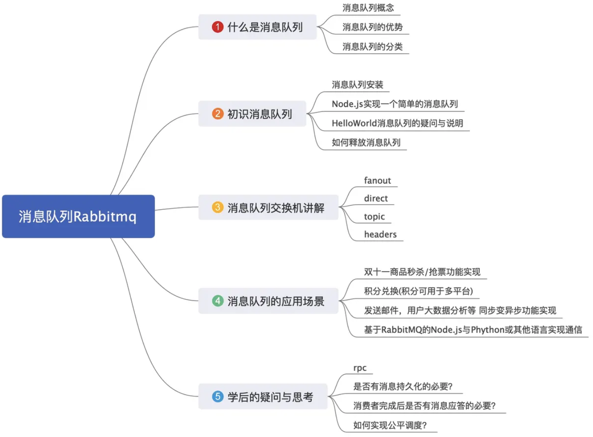

# interview - nodejs

## [cross JS / C++ Boundary](https://blog.insiderattack.net/crossing-the-js-c-boundary-advanced-nodejs-internals-part-1-cb52957758d8)

## [Worker from v10.5.0](https://blog.insiderattack.net/deep-dive-into-worker-threads-in-node-js-e75e10546b11)

## Message Queue 消息队列
> [参考1](https://juejin.im/post/5dd8cd7ae51d4523501f7331)

在消息的传输过程中保存消息的容器。Kafka, RocketMQ (阿里), RabbitMQ


- 应用解耦
- 灵活性和峰值处理能力
- 排序保证 (FIFO)
- 异步通信
- 可扩展性

使用 MQ
```js
const amqp = require('amqplib');

async function  product(params) {
  // 1.创建链接对象
  const connect = await amqp.connect('amqp://localhost:5672');
  // 2. 获取通道
  const channel = await connect.createChannel();
  // 3. 声明参数
  const routingKey = 'helloKoalaQueue';
  const msg = 'hello koala';
  for (let i=0; i<10000; i++) {
    // 4. 发送消息
    await channel.publish('', routingKey, Buffer.from(`${msg} 第${i}条消息`));
  }
  // 5. 关闭通道
  await channel.close();
  // 6. 关闭连接
  await connect.close();
}
product();

async function consumer() {
  // 1. 创建链接对象
  const connection = await amqp.connect('amqp://localhost:5672');
  // 2. 获取通道
  const channel = await connection.createChannel();
  // 3. 声明参数
  const queueName = 'hello';
  // 4. 声明队列，交换机默认为 AMQP default
  await channel.assertQueue(queueName);
  // 5. 消费
  await channel.consume(queueName, msg => {
    console.log('Consumer：', msg.content.toString());
    channel.ack(msg);
  });
}
consumer();
```
