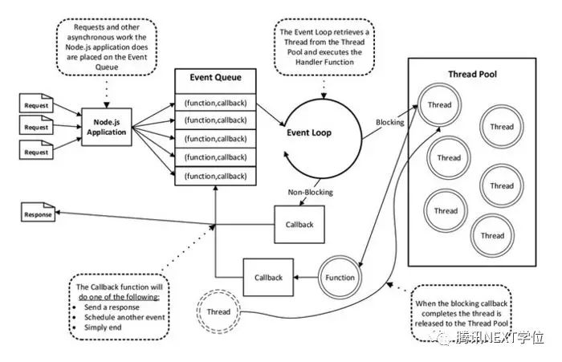

# interview - nodejs

## 高性能核心



- 单线程, 无线程调度 (thread scheduling) 开销, 多进程内存开销较大
- 异步 IO, 主线程不阻塞

linux 在使用 CFS 调度器的情况下，其调度开销大约为 O (logm), 其中 m 为活跃上下文数，其大约等同于活跃的客户端数，因此每次线程遇到 IO 阻塞时，都会进行调度从而产生 O (logm) 的开销。这在 QPS 较大的情况下是一笔不小的开销。

## [cross JS / C++ Boundary](https://blog.insiderattack.net/crossing-the-js-c-boundary-advanced-nodejs-internals-part-1-cb52957758d8)

## child_process 做并发

## worker -- Node.js 并发的关键

[V8 Isolates](https://v8docs.nodesource.com/node-0.8/d5/dda/classv8_1_1_isolate.html) 能同步运行 workers, 其为一个独立的 runtime 实例和独立的 eventloop (独立 js 堆和微任务队列), 和其他 worker 完全隔离, 拥有独立的但能共享内存,

[Worker from v10.5.0](https://blog.insiderattack.net/deep-dive-into-worker-threads-in-node-js-e75e10546b11)

## llhttp v12 替代 http parser (c语言实现)

### 性能优化方案

Worker Thread Pooling

## Message Queue 消息队列

> [参考1](https://juejin.im/post/5dd8cd7ae51d4523501f7331)

在消息的传输过程中保存消息的容器。Kafka, RocketMQ (阿里), RabbitMQ


- 应用解耦
- 灵活性和峰值处理能力
- 排序保证 (FIFO)
- 异步通信
- 可扩展性

使用 MQ

```js
const amqp = require('amqplib');

async function  product(params) {
  // 1.创建链接对象
  const connect = await amqp.connect('amqp://localhost:5672');
  // 2. 获取通道
  const channel = await connect.createChannel();
  // 3. 声明参数
  const routingKey = 'helloKoalaQueue';
  const msg = 'hello koala';
  for (let i=0; i<10000; i++) {
    // 4. 发送消息
    await channel.publish('', routingKey, Buffer.from(`${msg} 第${i}条消息`));
  }
  // 5. 关闭通道
  await channel.close();
  // 6. 关闭连接
  await connect.close();
}
product();

async function consumer() {
  // 1. 创建链接对象
  const connection = await amqp.connect('amqp://localhost:5672');
  // 2. 获取通道
  const channel = await connection.createChannel();
  // 3. 声明参数
  const queueName = 'hello';
  // 4. 声明队列，交换机默认为 AMQP default
  await channel.assertQueue(queueName);
  // 5. 消费
  await channel.consume(queueName, msg => {
    console.log('Consumer：', msg.content.toString());
    channel.ack(msg);
  });
}
consumer();
```
