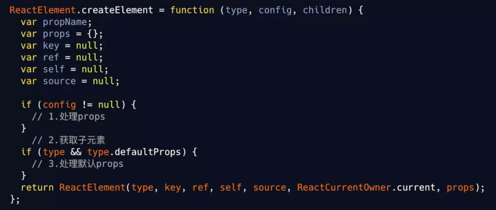

# interview - React

## Concept 基本原理
react.js is a library for UI view layer via manipulating virtual dom; react-dom and react-native are the implementation for the platforms.

## 纯函数
- 相同的输入产生相同的输出（不能在内部使用 Math.random,Date.now 这些方法影响输出）
- 输出不能和输入值以外的任何东西有关（不能调用 API 获得其他数据）
- 函数内部不能影响函数外部的任何东西（不能直接改变传入的引用变量），即不会突变

### Virtual DOM
通过类似 html tag 的 `JSX`, 使用 babel 创建 `vdom`, 根据虚拟dom 渲染 dom tree, 每次更新 diff vdom, 然后重新渲染.

[参考](https://juejin.im/post/5cb66fdaf265da0384128445) !!!


KEY babel transform
```json
{
  "plugins": [
    ["transform-react-jsx", {
      "pragma": "React.createElement"
    }]
  ]
}
```

`createElement()`, 数据结构如下


```ts
// ReactElement
{
  $$typeof: REACT_ELEMENT_TYPE,
  type,
  key,
  ref,
  props,
  _owner: owner,
}
```
`React.Component`
```js
function Component(props, context, updater) {
  this.props = props;
  this.context = context;
  // If a component has string refs, we will assign a different object later.
  this.refs = emptyObject;
  // We initialize the default updater but the real one gets injected by the
  // renderer.
  this.updater = updater || ReactNoopUpdateQueue;
}
Component.prototype.isReactComponent = {};
Component.prototype.setState = function(partialState, callback) {
  this.updater.enqueueSetState(this, partialState, callback, 'setState');
};
Component.prototype.forceUpdate = function(callback) {
  this.updater.enqueueForceUpdate(this, callback, 'forceUpdate');
};
```
`ReactDOM`
```js
const ReactDOM: Object = {
  createPortal,
  findDOMNode(
    componentOrElement: Element | ?React$Component<any, any>,
  ): null | Element | Text {},
  hydrate(element: React$Node, container: DOMContainer, callback: ?Function) {
    return legacyRenderSubtreeIntoContainer(null, element, container, true, callback,);
  },
  render(element: React$Element<any>, container: DOMContainer, callback: ?Function,) {
    return legacyRenderSubtreeIntoContainer(null, element, container, false, callback,);
  },
  // ...
};
```

### LifeCycle / Hooks Management


### `setState()`
async, batch, trigger `update` & `rerender` (if `shouldComponentUpdate` is not optimized)

在实际开发中，setState 的表现有时会不同于理想情况:
- 在 mount 流程中调用 setState。
- 在 setTimeout/Promise 回调中调用 setState。
在第一种情况下，不会进入 update 流程，队列在 mount 时合并修改并 render。

在第二种情况下，setState 将不会进行队列的批更新，而是直接触发一次 update 流程。

这是由于 setState 的两种更新机制导致的，只有在 **批量更新模式** 中，才会是 “异步” 的。

直接传递对象的 `setState({ ... }, () => {})` 会被合并成一次

使用函数传递 `setState(prev => ({}), () => {})` 不会被合并

因此
```js
componentDidMount() {
  this.setState({ index: this.state.index + 1 }, () => {
    console.log(this.state.index);
  })
  this.setState({ index: this.state.index + 1 }, () => {
    console.log(this.state.index);
  })
  // 1, 1
}
componentDidMount() {
  this.setState(preState => ({ index: preState.index + 1 }), () => {
    console.log(this.state.index);
  })
  this.setState(preState => ({ index: preState.index + 1 }), () => {
    console.log(this.state.index);
  })
  // 2, 2
}
```

### Diff VDOM ( O(n^3) -> O(n) )
> 参考[知乎](https://zhuanlan.zhihu.com/p/20346379)
开销最大, 可做优化最多, 三条基本策略/依据:
- WebUI 中 DOM 节点跨节点的操作特别少，可以忽略不计。
- 拥有相同类的组件会拥有相似的 DOM 结构。拥有不同类的组件会生成不同的 DOM 结构。
- 同一层级的子节点，可以根据唯一的 ID 来区分。

具体方法:
- `Tree Diff`: 对树进行分层比较，只对比两棵树同级别的节点。跨层级移动节点，将会导致节点删除，重新插入，无法复用。
- `Component Diff`: 对组件进行类比较，类相同的递归 diff 子节点，类不同的销毁重建。diff 对同一层级的子节点进行处理时，会根据 key 进行简要的复用。两棵树中存在相同 key 的节点时，只会移动节点。可通过 `shouldComponentUpdate()` 优化
- `Element Diff`: 对比同一层级子节点时, 以新树的第一个子节点作为起点遍历新树，寻找旧树中与之相同的节点。存在则移动位置, 不存在则新建一个子节点. 通过设置 `key`, 减少类似将最后一个节点移动到列表首部的操作 来进行优化

#### Diff 优化
- 减少 update 次数, 减少非理想状况的 `setState()`
- 减少跨层级移动节点, 尽量平行移动
- 使用合适的 key

`forceUpdate` 调用后将会直接进入 componentWillUpdate 阶段，无法拦截，因此在实际项目中应该弃用。

### BatchedUpdates 批量更新
可以说，setState是对单个组件的合并渲染，batchedUpdates是对多个组件的合并渲染。合并渲染是 React 最主要的优化手段。

### React patch, Event System 任务系统
`updateFiberAndView` 是位于一个 `requestIdleCallback` 中，因此它的时间很有限，分给 DFS 部分的时间也更少，因此它们不能做太多事情。这怎么办呢，标记一下，留给 commit 阶段做。于是产生了一个任务系统。

每个 Fiber 分配到新的任务时，就通过位操作，累加一个 sideEffect。sideEffect 字面上是副作用的意思，非常重 FP 流的味道，但我们理解为任务更方便我们的理解。

每个 Fiber 可能有多个任务，比如它要插入 DOM 或移动，就需要加上 Replacement，需要设置样式，需要加上 Update。

怎么添加任务呢？
```js
fiber.effectTag |= Update
```
怎么保证不会重复添加相同的任务？
```js
fiber.effectTag &= ~DidCapture;
```
在 commit 阶段，确保其包含了某项任务, 相同性质任务只执行一次, 也可用素数乘除实现
```js
if(fiber.effectTag & Update){ /*操作属性*/}
```

任务参考 `TypeOfSideEffect`

### Fiber
> [英文架构分析](https://github.com/acdlite/react-fiber-architecture)

Fiber 代表一种工作量单位 (unit of work) / 时间切片 (time slicing).

> A Fiber is work on a Component that needs to be done or was done. There can be more than one (but at most two, current and alternate) per component. (Component._reactInternalFiber)
current fiber will be replaced by alternate after update

关键属性 (省略部分i)
```ts
type Fiber = { // 双向链表结构
  tag: TypeOfWork,
  key: null | string, // Unique identifier of this child.
  type: any,   // The function/class/module associated with this fiber
  stateNode: any,  // local state associated with the fiber
  
  /* the Fiber that the result of this fiber process should be merged to */
  return: Fiber|null,         //  parent node
  child: Fiber|null,          //  first child node
  sibling: Fiber|null,        //  sibling node

  // Input is the data coming into process this fiber. Arguments. Props.
  pendingProps: any, // This type will be more specific once we overload the tag.
  memoizedProps: any, // The props used to create the output.
  
  // A queue of state updates and callbacks.
  updateQueue: UpdateQueue<any> | null,
  memoizedState: any, // The state used to create the output

  // Effect
  effectTag: TypeOfSideEffect,
  nextEffect: Fiber|null,   // next node in singly linked list of effects
  firstEffect: Fiber|null,
  lastEffect: Fiber|null,   // head & tail fiber with side-effect within this subtree  

  alternate: Fiber|null,  // pooled version of a fiber
  mode: TypeOfMode,
  // A linked-list of contexts that this fiber depends on
  firstContextDependency: ContextDependency<mixed> | null,
}
enum TypeOfWork {
  IndeterminateComponent=0, // Before we know whether it is functional or class
  FunctionalComponent=1,
  ClassComponent=2,         // inherit from React Component
  HostRoot=3,     // Root of a host tree by ReactDOM/ReactNative.render().
  HostPortal=4,     // A subtree. Could be an entry point to a different renderer.
  HostComponent=5,     // injected by host environment, e.g. DOM in browser
  HostText=6,
  CoroutineComponent=7,
  CoroutineHandlerPhase=8,
  YieldComponent=9,
  Fragment=10,
  Mode=11,
}
// TypeOfSideEffect
export const NoEffect = /*              */ 0b00000000000;
export const PerformedWork = /*         */ 0b00000000001;
// You can change the rest (and add more).
export const Placement = /*             */ 0b00000000010;
export const Update = /*                */ 0b00000000100;
export const PlacementAndUpdate = /*    */ 0b00000000110;
export const Deletion = /*              */ 0b00000001000;
export const ContentReset = /*          */ 0b00000010000;
export const Callback = /*              */ 0b00000100000;
export const DidCapture = /*            */ 0b00001000000;
export const Ref = /*                   */ 0b00010000000;
export const Snapshot = /*              */ 0b00100000000;
// Update & Callback & Ref & Snapshot
export const LifecycleEffectMask = /*   */ 0b00110100100;
// Union of all host effects
export const HostEffectMask = /*        */ 0b00111111111;
export const Incomplete = /*            */ 0b01000000000;
export const ShouldCapture = /*         */ 0b10000000000;
enum Priority {
  NoWork=0, // No work is pending.
  SynchronousPriority=1, // For controlled text inputs. Synchronous side-effects.
  TaskPriority=2, // including animation (by requestAnimationFrame), Completes at the end of the current tick.
  HighPriority=3, // completed by requestIdleCallback, Interaction that needs to complete pretty soon to feel responsive
  LowPriority=4, // can be delayed, such as data fetching, or result from updating stores.
  OffscreenPriority=5, // Won't be visible but do the work in case it becomes visible.
}
```

#### 特点
- 把未完成的工作中可中断的任务拆分, Cooperative scheduling
- 对正在做的工作确定并根据情况变化调整优先级
- 复用已完成的单位, 或重做
- 丢弃不需要再做的任务
- 增量渲染, 可控更新
- 父子任务间切换
- 不同类型的更新有优先级
- 并发

### Reconciliation & Render


> [React16 源码之 React Fiber 架构](https://github.com/HuJiaoHJ/blog/issues/7#)<br>
> [参考司徒正美](https://zhuanlan.zhihu.com/p/37095662) <br>
> [理解 React Fiber 架构](https://libin1991.github.io/2019/07/01/%E7%90%86%E8%A7%A3-React-Fiber-%E6%9E%B6%E6%9E%84/)

以下为引用内容

把渲染更新过程拆分成多个子任务，每次只做一小部分，做完看是否还有剩余时间，如果有继续下一个任务；如果没有，挂起当前任务，将时间控制权交给主线程，等主线程不忙的时候在继续执行。 这种策略叫做 Cooperative Scheduling（合作式调度），操作系统常用任务调度策略之一。

合作式调度主要就是用来分配任务的，当有更新任务来的时候，不会马上去做 Diff 操作，而是先把当前的更新送入一个 Update Queue 中，然后交给 Scheduler 去处理，Scheduler 会根据当前主线程的使用情况去处理这次 Update。

为了实现这种特性，使用了 `requestIdleCallback` API。对于不支持这个 API 的浏览器，用 ReactScheduler

在上面我们已经知道浏览器是一帧一帧执行的，在两个执行帧之间，主线程通常会有一小段空闲时间，requestIdleCallback 可以在这个空闲期（Idle Period）调用空闲期回调（Idle Callback），执行一些任务。

- 低优先级任务由 requestIdleCallback 处理；
- 高优先级任务，如动画相关的由 requestAnimationFrame 处理；
- requestIdleCallback 可以在多个空闲期调用空闲期回调，执行任务；
- requestIdleCallback 方法提供 deadline，即任务执行限制时间，以切分任务，避免长时间执行，阻塞 UI 渲染而导致掉帧；

这个方案看似确实不错，但是怎么实现可能会遇到几个问题：

- 如何拆分成子任务？
- 一个子任务多大合适？
- 怎么判断是否还有剩余时间？
- 有剩余时间怎么去调度应该执行哪一个任务？
- 没有剩余时间之前的任务怎么办？

接下里整个 Fiber 架构就是来解决这些问题的。

react 本身为了提高页面渲染性能，推出了一些最佳实践

1. vdom 减少对 dom 的直接操作
2. 无状态组件 减少组件内部状态和复杂度
3. shouldComponentUpdate 减少 diff 的次数
4. immutable 减少 diff 的成本

#### 补充
操作系统常用任务调度策略：先来先服务（FCFS）调度算法、短作业（进程）优先调度算法（SJ/PF）、最高优先权优先调度算法（FPF）、高响应比优先调度算法（HRN）、时间片轮转法（RR）、多级队列反馈法。

#### React runtime instances
1. DOM
1. Elements
2. Instances (generate from elements, fiber tree inside)
   - fiber tree (current context)
   - workInProgress tree (temp, snapshot to be updated)
   - effect list (temp, merged side effect list from workInProgress)

### HTML 转义
 React 会将所有要显示到 DOM 的字符串转义，防止 XSS。所以，如果 JSX 中含有转义后的
   实体字符，比如 &copy;（©），则最后 DOM 中不会正确显示，因为 React 自动把 &copy; 中的特
   殊字符转义了。有几种解决办法：
   -  直接使用 UTF-8 字符 ©；
   -  使用对应字符的 Unicode 编码查询编码；
   - 使用数组组装 `<div>{['cc ', <span>&copy;</span>, ' 2015']}</div>`；
   - 直接插入原始的 HTML。
   
   此外，React 提供了 dangerouslySetInnerHTML 属性。正如其名，它的作用就是避免 React 转
   义字符，在确定必要的情况下可以使用它：
   <div dangerouslySetInnerHTML={{__html: 'cc &copy; 2015'}} /> 

## Q & A
> refer to https://juejin.im/post/5dc20a4ff265da4d4e30040b

Key points:

`<ErrorBoundary>`:

`hooks`: 允许在不编写类的情况下使用 state 和其他 React 特性, 减少层级嵌套或重写。使用 Hooks，可以从组件中提取有状态逻辑，这样就可以独立地测试和重用它。Hooks 允许在不改变组件层次结构的情况下重用有状态逻辑，这样在许多组件之间或与社区共享 Hooks 变得很容易。

`<StrictMode>`: 验证内部组件是否遵循某些推荐做法，如果没有，会在控制台给出警告。

验证是否使用的已经废弃的方法，如果有，会在控制台给出警告。

通过识别潜在的风险预防一些副作用。

`prop drilling`: prop 层层传递, 可以用 `React.Context` 或 `状态管理库` 代替

`Fiber`: 新的`协调引擎`或重新实现核心算法。它的主要目标是支持`虚拟 DOM 的增量渲染` (能够将渲染工作分割成块，并将其分散到多个帧中)。React Fiber 的目标是提高其在动画、布局、手势、暂停、中止或重用等方面的适用性，并为不同类型的更新分配优先级，以及新的并发原语。
