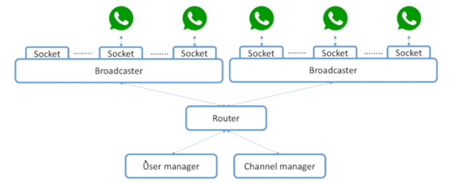

# interview - system design

> <https://soulmachine.gitbooks.io/system-design/content/cn/>

## 通用方法

1. 拿到题目后，**先分析拆解**，询问细节需求并和面试官保持沟通
2. 什么场景，用户量，访问量(QPS), 分解需求写出功能列表并筛选出核心功能列表
3. 采用什么级别的存储模式，建表 [ 数据库系统，文件系统，缓存系统 ]， 比如管理关系性强的数据如 twitter 用户数据，用 SQL, 推文相关，用 NoSQL, 媒体文件用 文件存储系统，如 Amazon S3，用户之间的关系用图数据库

当面试官要求你在45分钟内设计大规模分布式系统时，你需要指出高层组件并描述它们之间如何交互的，而不是花时间说明如何通过避免缓冲区副本的方式来减少20毫秒反应时间的。

高层模块：计算，存储，后端，前端，缓存，队列，网络，负载均衡，限流，权限验证，大数据统计，可扩展性(如中间件机制，插件机制)等

技术上实现，非技术上实现等

API design
[RESTFUL](https://arunrajeevan.medium.com/dos-and-donts-in-rest-736c561e00fa), graphql

### QPS 预估

- 一台 Web Server承受量约为 1K的QPS（考虑到逻辑处理时间以及数据库查询的瓶颈）
- 一台 SQL Database承受量约为 1K的QPS（如果JOIN和INDEX query比较多的话，这个值会更小）
- 一台 NoSQL Database (Cassandra) 约承受量是 10k 的 QPS；
- 一台 NoSQL Database (Memcached) 约承受量是 1M 的 QPS。

## 常见例子

### 1. 分布式 ID 生成器

- MongoDB UUID
- round-robin load balancer + 多台 MySQL 生成不同 ID 段
- Twitter Snowflake

### 2. 短 URL 系统

设计要点

- 长度不超过 7 [a-zA-Z0-9]
- 一长对多短, 以这个 7 位长度的短网址作为唯一 ID，这个 ID 下可以挂各种信息，比如生成该网址的用户名，所在网站，HTTP 头部的 User Agent 等信息，收集了这些信息，才有可能在后面做大数据分析，挖掘数据的价值。短网址服务商的一大盈利来源就是这些数据。
- 302 重定向, 因 301 SEO 直接跳真实地址, 无法统计/拦截
- 使用分布式 ID 生成器 key(short)-value(long) -> 分布式 KV 数据库如 redis, levelDB
- 可以把域名分为 domain + path, 分别建表
- 处理高并发, 不同服务器分发不同号段, 如共 5 台服务器, 第一台发 5n, 第二台 5n+1
- 确保一个长 url 返回的是同一短 url, 用 key(long)-value(short)
- 确保上述的可行性和性能, LRUcache
- 如资源有限, 需要过期一部分短链接, 查上述 LRUcache 即可
- 如需防攻击, IP 限制个数, 监测整个系统限流

### 3. [Feed 流](https://zhuanlan.zhihu.com/p/30226315)

### 4. Whatsapp 设计

参考：[硅谷之路 58: 如何设计 WhatsAPP](https://zhuanlan.zhihu.com/p/20923244)

参考 [System Design: WhatsApp](https://interviewdaemon.medium.com/system-design-whatsapp-788705bd4fb0)

#### 数据结构，数据库

表设计

- user: profile
- friend: user id 的相互关联
- channel: 单对单或聊天群组
- message: 需要不停新增，修改或删除极少

SQL 处理 `user` `friend` `channel`, NoSQL 处理 `message`

架构

user manager

channel manager

用独立服务器开多个 socket 监听请求，中间通过 router 转发请求。

#### 支持高并发/百万级同时在线

首先计算一下需求，假设有一百万用户同时在线，但是用户发消息的频率一般来说并不高，大概十分钟一条，每条 30B。所以每秒有 50GB 的数据量，是一个很大的值，有没有办法缩减呢？

方法

1. 消息打包，批量发送（通过一个 http / socket），共享信息头和信息尾， messagequeue
2. 消息压缩

#### 发给离线用户消息

如果用户当前不在线，发给他的消息怎么办呢？如果用户换了一台设备，还可以查阅历史记录吗？能不能搜索历史记录呢？

Twitter 架构设计中讲了非常通用的 push／pull 模型。push 模型就是当用户写了新的 tweet 就发送给所有的 follower；而 pull 模型就是用户只写在自己的 timeline 里，当 follower 查看消息的时候才从 timeline 里获取数据。

这个 push／pull 模型是数据层面的，如果我们想实现新消息提醒这样的功能，我们可以使用 link 层面的 push／pull 模型。link－pull 是用户和服务器之间不建立长连接，而采用轮巡的策略，每隔几秒 check 一下有没有新消息；或者采用 link－push 模型，维护服务器和用户之间的长连接，这样有新消息服务器就可以直接 push 给用户了。

那么 push 和 pull 各有什么优缺点呢？push 比较快更及时，但是如果用户并不需要经常 check 的话维护这么多长连接是很浪费的。pull 会有一些 delay，而且如果用户并没有新消息，不断轮巡其实也很浪费，还会耗费带宽。

所以一种方式是将 push／pull 模型进行组合，可以 push 给用户新消息的数目，当用户想要查看的时候 pull 获取所有消息。

还有一个问题是如何通知用户上线／下线的消息呢？如果用户上线／下线就立刻发送消息的话，网络状况不稳定的时候可能会出现用户不断上线／下线的情况。

所以没有必要通知地那么及时，可以适当地 lazy 一点，等待 5s 再通知就避免了上述情况。

#### 加密

针对每个 channel 使用同步加密算法

### 5. 权限控制系统 RBAC

### 6. Youtube / Netflix 系统特征

- qps 巨大
- region 多，跨大洋大洲
- 弹性服务
- 宕机处理
- 文件存储系统
- 非文件类存储系统
- 视频流设计
- 会员制，权限设计
- 权限