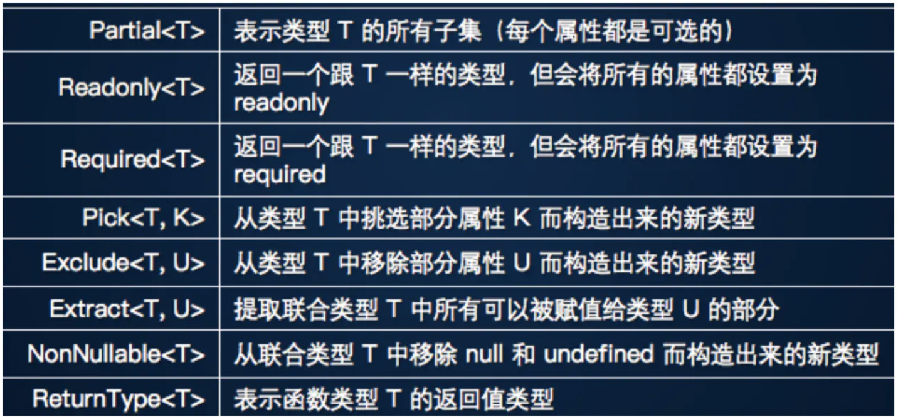

# interview - typescript

## 文档

- [中文入门](https://ts.xcatliu.com/)

## 常用特性

类型检查, 私有/保护变量, 装饰器 (方法/属性/参数/工厂) +[元数据反射](https://zhuanlan.zhihu.com/p/42220487)(reflect metadata)

### `type` vs `interface`

写法略有不同

```ts
type user = {
  name: string
  age: number
}
interface IUser {
  name: string
  age: number
}
```

`interface` 应该用于 `实现`，即和 `implements` 结合使用。

```ts
interface serializeable {
  tostring(): string
  fromString(str: string): void
}

class SendData implements serializeable {
  name: string
  age: number

  constructor(name: string, age: number) {
    this.name = name
    this.age = age
  }
  public tostring() {
    return JSON.stringify({
      name: this.name,
      age: this.age
    })
  }
  public fromString(str: string) {
    let data = JSON.parse(str)
    this.name = data.name
    this.age = data.age
  }
}

function sendToServer(obj: serializeable) {}

sendToServer(new SendData("name", 18))
```

### 函数声明 function declaration

```ts
function sum(x: number, y: number): number {
  return x + y
}
```

### 泛型

```ts
```

能接受多种类型的 repeat()

```ts
function repeat<T>(item: T, count: number): T[] {
  let result: T[] = []
  for (let i = 0; i < count; i++) {
    result.push(item)
  }
  return result
}
let arr: number[] = repeat<number>(13, 4)
let arr2: string[] = repeat<string>("aaa", 4)
```

### 类型推测

泛型的例子, 不传类型也可以自行推断

```ts
// ...
let arr: number[] = repeat(13, 4)
```

### 装饰器 decorator



### this (todo)

[详解 Typescript 里的 This](https://zhuanlan.zhihu.com/p/104565681)

## react 中使用 typescript

- [优雅的在 react 中使用 TypeScript](https://juejin.im/post/5bed5f03e51d453c9515e69b)
- [TypeScript 在 React 中使用总结](https://juejin.im/post/5bab4d59f265da0aec22629b)
- [typescript 函数类型](https://juejin.im/post/5d10e242f265da1b6b1ce24b)
- [ts 最佳实践](https://juejin.im/post/5e095ddb6fb9a016391d5d58)

### 常用类型

参考 [在 React 项目中优雅地使用 Typescript](https://segmentfault.com/a/1190000020536678)

```js
interface IProps {
  // CSSProperties提供样式声明的类型信息
  // 用户传入style的时候就能够获得类型检查和代码补全
  style?: React.CSSProperties;
  // 使用@types/react提供的事件类型定义，这里指定event.target的类型是HTMLButtonElement
  onClick(event: React.MouseEvent<HTMLButtonElement>): void;
  // ...
}
// IProps 无需声明 children 属性的类型。React.FC 会自动为 props 添加这个属性类型。
const MyComponent: React.FC<IProps> = props => {
  const { children, ...restProps } = props // props 无需做类型标注
  return <div {...restProps}>{children}</div>
}
```
